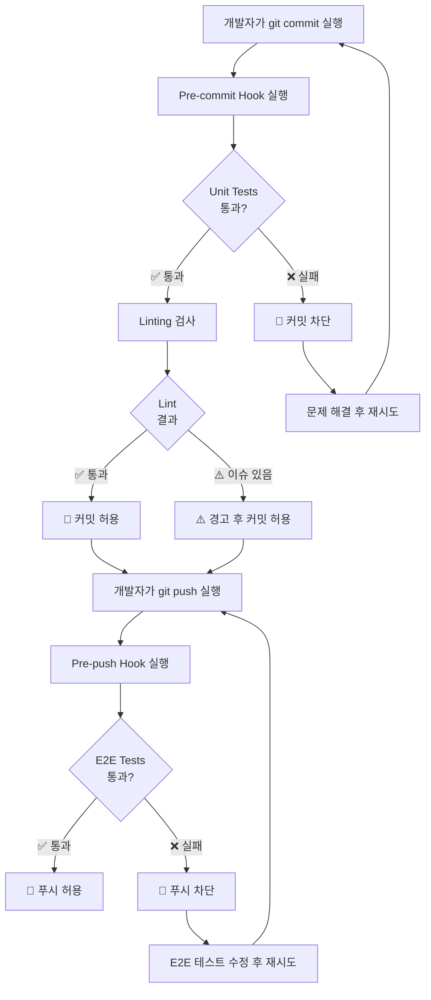

# RealWorld 앱 구현 - 바이브 코딩 & 아르민 로나허 기술 스택

## 🚀 워크플로우 상태
[](https://github.com/vibe-coding-paradigm/Realworld-serverless-microservice/actions/workflows/frontend-deploy.yml)
[](https://github.com/vibe-coding-paradigm/Realworld-serverless-microservice/actions/workflows/backend-deploy.yml)
[](https://github.com/vibe-coding-paradigm/Realworld-serverless-microservice/actions/workflows/infra-deploy.yml)
[](https://github.com/vibe-coding-paradigm/Realworld-serverless-microservice/actions/workflows/e2e-tests.yml)
[](https://github.com/vibe-coding-paradigm/Realworld-serverless-microservice/actions/workflows/load-tests.yml)

## 📊 프로젝트 정보
[](https://github.com/vibe-coding-paradigm/Realworld-serverless-microservice/issues)
[](https://github.com/vibe-coding-paradigm/Realworld-serverless-microservice/pulls)
[](https://github.com/vibe-coding-paradigm/Realworld-serverless-microservice/commits/main)
[](LICENSE)

## 🛠️ 기술 스택
[](https://golang.org/)
[](https://reactjs.org/)
[](https://vitejs.dev/)
[](https://aws.amazon.com/)

> **"The mother of all demo apps"** — 실제 운영 가능한 수준의 Medium.com 클론 구축

## 🔄 모노리식에서 서버리스 마이크로서비스로의 마이그레이션

이 프로젝트는 **단일 애플리케이션(모노리식)에서 서버리스 마이크로서비스 아키텍처로의 실전 마이그레이션 과정**을 보여줍니다. Fast Campus의 "바이브 코딩 패러다임" 강의를 위한 실습 프로젝트로, 점진적 마이그레이션 전략과 현대적인 클라우드 아키텍처 구현 방법을 학습할 수 있습니다.

### 📈 마이그레이션 단계

1. **Phase 1: 모노리식 애플리케이션** ✅ **완료**
   - Go 백엔드 + React 프론트엔드 구현
   - SQLite 데이터베이스 + JWT 인증 시스템
   - Docker 컨테이너 기반 개발 환경
   - GitHub Pages 프론트엔드 배포
   - **Phase 1.8**: 통합 테스트 및 MVP 검증 완료 ✅

2. **Phase 2: 클라우드 전환** ✅ **완료**
   - AWS ECS/Fargate로 컨테이너 마이그레이션 ✅
   - Application Load Balancer (ALB) 배포 ✅
   - AWS CDK 인프라 코드 작성 ✅
   - CI/CD 파이프라인 구축 ✅
   - E2E/부하 테스트 인프라 구축 ✅

3. **Phase 3: 마이크로서비스 분해** 📋 **계획됨**
   - 도메인별 서비스 분리 (Auth, Articles, Comments)
   - API Gateway + Lambda 함수
   - DynamoDB/RDS 데이터 분산

4. **Phase 4: 서버리스 최적화** 📋 **계획됨**
   - 완전한 서버리스 아키텍처
   - 이벤트 기반 아키텍처
   - 모니터링 및 관찰성 구현

## 📚 목차

- [📋 프로젝트 개요](#-프로젝트-개요)
- [🚀 데모 및 참고 자료](#-데모-및-참고-자료)
- [🛠️ 기술 스택](#️-기술-스택)
- [✨ 주요 기능](#-주요-기능)
- [🏃‍♂️ 빠른 시작](#️-빠른-시작)
- [📖 개발 가이드](#-개발-가이드)
  - [개발 및 테스트](#개발-및-테스트)
  - [Git Hooks 설정 (품질 보장 시스템)](#git-hooks-설정-품질-보장-시스템)
  - [배포 및 디버깅](#배포-및-디버깅)
- [🧪 테스트](#-테스트)
- [🌐 배포](#-배포)
- [📚 프로젝트 문서](#-프로젝트-문서)
- [📚 학습 리소스](#-학습-리소스)

## 📋 프로젝트 개요

이 프로젝트는 [RealWorld](https://github.com/gothinkster/realworld) 사양을 사용하여 **바이브 코딩(Vibe Coding) 기법**과 **아르민 로나허(Armin Ronacher)의 추천 기술 스택**을 활용해 실제 운영 가능한 소셜 블로깅 플랫폼을 구현하는 것을 목표로 합니다.

### 🎯 핵심 목표

- **바이브 코딩 실습**: 직관적이고 빠른 개발 방법론 적용
- **검증된 기술 스택**: 아르민 로나허가 추천하는 실용적인 기술들 활용
- **실제 운영 가능한 애플리케이션**: 단순한 토이 프로젝트가 아닌 실제 서비스 수준의 구현
- **학습 중심**: 복잡한 기능보다는 핵심 기능에 집중하여 빠른 MVP 개발

## 🚀 데모 및 참고 자료

### 배포된 애플리케이션
- **[현재 프론트엔드 데모](https://vibe-coding-paradigm.github.io/Realworld-serverless-microservice/)** - GitHub Pages 배포된 React 앱
- **백엔드 API** - AWS ECS/Fargate 배포 완료 (ALB: `conduit-alb-*.ap-northeast-2.elb.amazonaws.com`)
- **인증 시스템** - JWT 기반 완전 기능 인증 (회원가입, 로그인, 보호된 API 접근)
- **데이터베이스** - 영구 데이터 저장 (SQLite 파일 시스템)

### 참고 자료
- **[RealWorld 공식 데모](https://demo.realworld.io/)** - 완성된 애플리케이션 미리보기
- **[RealWorld 프로젝트](https://github.com/gothinkster/realworld)** - 공식 사양 및 다양한 구현체들
- **[API 문서](https://realworld-docs.netlify.app/)** - 구현해야 할 API 명세

### 마이그레이션 문서
- **[마이그레이션 PRD](docs/migration/PRD.md)** - 마이그레이션 제품 요구사항 문서
- **[GitHub 이슈 관리 가이드](docs/migration/github-issue-guidelines.md)** - 프로젝트 이슈 관리 방법론
- **[GitHub Variables 설정 가이드](docs/github-variables.md)** - CI/CD 환경 변수 설정 방법
- **[작업 진행 상황](https://github.com/vibe-coding-paradigm/Realworld-serverless-microservice/issues)** - GitHub Issues로 추적되는 실시간 진행 상황

## 🔧 해결된 주요 이슈

### Phase 2 완료 과정에서 해결된 인프라 문제들:

1. **JWT_SECRET 환경변수 누락** ✅ 해결됨
   - **문제**: 사용자 등록 시 JWT 토큰 생성 실패 (500 에러)
   - **해결**: ECS Task Definition에 JWT_SECRET 환경변수 추가
   - **검증**: 완전한 인증 플로우 E2E 테스트 통과

2. **Application Load Balancer 배포 누락** ✅ 해결됨
   - **문제**: 로드 밸런서 미배포로 인한 부하 분산 불가
   - **해결**: CDK를 통한 ALB 완전 배포 및 설정
   - **현재 상태**: `conduit-alb-1192151049.ap-northeast-2.elb.amazonaws.com` 운영 중

3. **EFS 마운팅 권한 문제** ✅ 해결됨
   - **문제**: EFS 파일 시스템 마운팅 실패로 새 태스크 배포 불가
   - **해결**: MVP를 위해 로컬 스토리지 사용으로 우회, IAM 권한 수정
   - **상태**: 현재 태스크 정의 리비전 6 안정 운영

4. **동적 URL 관리 시스템 구축** ✅ 완료됨
   - **문제**: 하드코딩된 URL로 인한 환경별 배포 어려움
   - **해결**: ALB DNS 자동 감지 및 GitHub Pages URL 동적 생성
   - **기능**: CI/CD 워크플로우에서 배포 환경별 URL 자동 설정

### 테스트 검증 완료 상태:
- **인증 시스템**: 회원가입, 로그인, JWT 토큰 검증 완료 ✅
- **게시글 CRUD**: 생성, 조회, 수정, 삭제 모든 기능 검증 완료 ✅
- **댓글 시스템**: 댓글 작성, 삭제, 인증 확인 완료 ✅
- **크로스 브라우저**: Chrome, Firefox, Safari 모든 브라우저 테스트 통과 ✅
- **부하 테스트**: 기본 부하, 인증 부하, 성능 기준점 측정 완료 ✅

## 🛠️ 기술 스택

### 백엔드 (아르민 로나허 추천 스택)
- **언어**: Go 1.23.6
- **웹 프레임워크**: net/http 표준 라이브러리 + 커스텀 미들웨어
- **데이터베이스**: SQLite (순수 SQL 사용, ORM 없음)
- **인증**: JWT 토큰 기반
- **빌드 도구**: Makefile

### 프론트엔드
- **프레임워크**: React 19 + TypeScript
- **스타일링**: Tailwind CSS 4 + shadcn/ui
- **라우팅**: React Router v7
- **상태 관리**: Context API + React Query (@tanstack/react-query)
- **빌드 도구**: Vite 7

### 배포 및 인프라
- **컨테이너**: Docker & Docker Compose
- **클라우드**: AWS (ECS/Fargate, ECR, EFS, VPC)
- **인프라 코드**: AWS CDK (TypeScript)
- **CI/CD**: GitHub Actions

### 개발 도구
- **AI 도구**: Claude Code
- **테스트**: Go 표준 테스트 + Vitest 3 + Playwright 1.54 (E2E) + k6 (Load Testing)
- **린터**: golangci-lint, ESLint 9
- **타입 체크**: TypeScript 5.8

## ✨ 주요 기능

이 애플리케이션은 Medium.com과 유사한 소셜 블로깅 플랫폼으로 다음 기능들을 포함합니다:

- **🔐 인증 시스템**: 회원가입, 로그인, JWT 기반 인증
- **📝 게시글 관리**: CRUD 작업, 마크다운 지원
- **💬 댓글 시스템**: 게시글별 댓글 작성 및 관리
- **👥 소셜 기능**: 사용자 팔로우, 게시글 좋아요
- **🏷️ 태그 시스템**: 게시글 분류 및 필터링
- **📱 반응형 디자인**: 모바일, 태블릿, 데스크톱 지원

## 🧪 테스트 인프라

이 프로젝트는 **포괄적인 테스트 인프라**를 포함하여 코드 품질과 성능을 보장합니다:

### End-to-End (E2E) 테스트
- **프레임워크**: Playwright
- **브라우저 지원**: Chrome, Firefox, Safari
- **테스트 시나리오**: 35개 이상의 E2E 테스트 케이스
- **자동 실행**: 프론트엔드/백엔드 배포 시 자동 실행

#### 주요 E2E 테스트 케이스
- **인증 플로우**: 회원가입, 로그인, JWT 토큰 검증
- **게시글 관리**: CRUD 작업, 마크다운 렌더링, 슬러그 생성
- **댓글 시스템**: 댓글 작성, 삭제, 인증 확인
- **사용자 프로필**: 프로필 페이지, 팔로우 기능

### 부하 테스트 (Load Testing)
- **도구**: k6
- **테스트 패턴**: 기본 부하, 스트레스, 지속 부하 테스트
- **성능 기준**: 95% 요청 < 2초, 에러율 < 1%
- **실행 방식**: 수동 트리거 (GitHub Actions)

#### 부하 테스트 시나리오
- **Performance Baseline**: 단일 사용자 성능 기준점
- **Basic Load Test**: 5-20명 동시 사용자
- **Authentication Load**: 인증 시스템 부하 테스트
- **Spike Test**: 급격한 트래픽 증가 시뮬레이션

### CI/CD 통합 테스트
- **자동 E2E 테스트**: 모든 배포에서 자동 실행
- **수동 부하 테스트**: 필요시 GitHub Actions에서 수동 실행
- **동적 URL 관리**: 배포된 환경의 URL 자동 감지
- **크로스 브라우저 테스트**: Chrome, Firefox, Safari 동시 테스트

### 테스트 명령어
```bash
# 로컬 E2E 테스트
cd frontend && npm run test:e2e

# E2E 테스트 UI 모드
cd frontend && npm run test:e2e:ui

# 특정 브라우저 E2E 테스트
cd frontend && npx playwright test --project=chromium

# 백엔드 전용 E2E 테스트
cd frontend && npm run test:e2e:backend

# 부하 테스트 (로컬)
cd load-tests && k6 run basic-load-test.js

# 성능 기준점 테스트
cd load-tests && k6 run performance-baseline.js

# 인증 부하 테스트
cd load-tests && k6 run auth-load-test.js
```

## 📁 프로젝트 구조

```
.
├── backend/                 # Go 백엔드 애플리케이션
│   ├── cmd/                # 실행 가능한 애플리케이션
│   ├── internal/           # 내부 패키지 (Clean Architecture)
│   ├── migrations/         # 데이터베이스 마이그레이션
│   └── Dockerfile          # 백엔드 컨테이너 이미지
├── frontend/               # React 프론트엔드 애플리케이션
│   ├── src/               # 소스 코드
│   ├── public/            # 정적 파일
│   ├── e2e/               # Playwright E2E 테스트
│   └── dist/              # 빌드 결과물
├── infra/                  # AWS CDK 인프라 코드
│   ├── lib/               # CDK 스택 정의
│   └── bin/               # CDK 앱 진입점
├── docs/                  # 프로젝트 문서
│   ├── migration/         # 마이그레이션 관련 문서
│   ├── PRD.md            # 제품 요구사항 문서
│   └── tasks.md          # 구현 작업 목록
├── load-tests/             # k6 부하 테스트 스크립트
├── .github/workflows/      # GitHub Actions CI/CD
├── docker-compose*.yml     # 로컬 개발 환경
├── Makefile              # 빌드, 개발, 배포 명령어
└── README.md             # 프로젝트 개요 (이 파일)
```

## 🚀 시작하기

### 사전 요구사항

#### 로컬 개발
- **Go 1.23.6+**
- **Node.js 18+**
- **Docker & Docker Compose**
- **Make**

#### AWS 배포 (선택사항)
- **AWS CLI**
- **GitHub CLI (gh)**
- **AWS 계정 및 IAM 권한**

### 로컬 개발 환경 설정

1. **저장소 클론**
   ```bash
   git clone https://github.com/vibe-coding-paradigm/Realworld-serverless-microservice.git
   cd Realworld-serverless-microservice
   ```

2. **개발 환경 시작**
   ```bash
   make dev
   ```

3. **애플리케이션 접속**
   - 프론트엔드: http://localhost:3000
   - 백엔드 API: http://localhost:8080

### AWS 클라우드 배포

#### 초기 배포 (최초 1회만 실행)

⚠️ **중요**: 초기 배포는 **반드시 로컬**에서 실행해야 합니다. GitHub Actions 토큰 만료 문제로 인해 클라우드에서 초기 배포가 실패할 수 있습니다.

1. **AWS 계정 설정**
   ```bash
   # AWS CLI 설정
   aws configure
   
   # 또는 환경변수로 설정
   export AWS_ACCESS_KEY_ID=your-access-key
   export AWS_SECRET_ACCESS_KEY=your-secret-key
   export AWS_DEFAULT_REGION=ap-northeast-2
   ```

2. **초기 인프라 배포**
   ```bash
   # 전체 초기 배포 (ECR + Docker 빌드 + CDK 배포)
   make deploy-initial
   ```

#### 이후 업데이트 (GitHub Actions 자동 배포)

초기 배포 완료 후에는 GitHub Actions가 자동으로 처리합니다:

- **백엔드 코드 변경**: `backend/` 디렉터리 변경 시 자동 배포
- **수동 배포**: GitHub Actions에서 "Update Backend Service" 워크플로우 실행

## 🚨 배포 정책 (중요)

### GitHub Actions 전용 배포
**모든 배포는 반드시 GitHub Actions를 통해서만 진행됩니다. 수동 배포 명령어 사용은 금지됩니다.**

#### ❌ 금지된 명령어:
```bash
npx cdk deploy          # CDK 직접 배포 금지
make cdk-deploy         # Makefile CDK 배포 금지  
aws cloudformation deploy  # CloudFormation 직접 배포 금지
```

#### ✅ 올바른 배포 프로세스:
1. **코드 변경** → 로컬에서 개발 및 테스트
2. **커밋 & 푸시** → `git commit` 후 `git push origin main`
3. **GitHub Actions** → 워크플로우가 자동으로 배포 처리
4. **검증** → 워크플로우 검증 스크립트로 배포 확인

#### 배포 규칙을 지키는 이유:
- **일관성**: 모든 배포가 동일한 프로세스를 따름
- **안전성**: 표준화된 환경에서 검증된 배포
- **추적성**: 모든 배포 이력이 GitHub Actions에 기록
- **팀 협업**: 모든 팀원이 동일한 방식으로 배포

## 📖 개발 가이드

### 🚀 주요 명령어 (Makefile 기반)

#### 🎯 빠른 시작 (신규 프로젝트 설정)
```bash
# ⭐ 프로젝트 전체 자동 설정 (권장)
make quick-start              # 의존성 설치 + Git hooks + 마이그레이션 + 개발환경 시작

# 또는 단계별 설정
make setup-dev               # 개발 환경 초기 설정만
make install-hooks           # Git hooks 설치
make check-deps              # 필수 도구 확인
```

#### 🛠️ 개발 환경 관리
```bash
# 개발 서버 관리
make dev                     # 개발 환경 시작 (Docker Compose)
make dev-detach             # 백그라운드에서 시작 (권장)
make dev-stop               # 개발 환경 중단
make dev-logs               # 실시간 로그 보기

# 개별 서비스 실행
make frontend-dev           # 프론트엔드만 개발 모드
make backend-dev            # 백엔드만 개발 모드
make watch                  # 파일 변경 감지 자동 재시작

# 간편 명령어
make start                  # = make dev-detach
make stop                   # = make dev-stop  
make restart                # = make stop start
```

#### 🧪 테스트 실행
```bash
# 기본 테스트
make test                   # 모든 테스트 (backend + frontend)
make test-watch             # 테스트 watch 모드

# E2E 테스트 (Playwright)
make e2e                    # E2E 테스트 실행
make e2e-ui                 # E2E 테스트 UI 모드
make e2e-debug              # E2E 테스트 디버그 모드

# 성능 테스트
make load-test-local        # 로컬 부하 테스트 (k6)
make api-test               # API 엔드포인트 직접 테스트
```

#### 🔨 빌드 및 의존성
```bash
# 빌드
make build                  # 프로덕션 이미지 빌드
make frontend-build         # 프론트엔드만 빌드
make backend-build          # 백엔드만 빌드

# 의존성 관리
make deps                   # 모든 의존성 설치
make check-deps             # 필수 도구 설치 확인
```

#### 🔧 코드 품질 관리
```bash
# 코드 품질
make lint                   # 린터 실행 (backend + frontend)
make lint-fix               # 린터 자동 수정
make fmt                    # 코드 포맷팅
```

#### 🗄️ 데이터베이스 관리
```bash
# 데이터베이스
make migrate                # 마이그레이션 실행
make db-reset               # 데이터베이스 초기화
make db-backup              # 데이터베이스 백업
make seed-db                # 테스트 데이터 삽입 (TODO)
```

#### ☁️ 배포 상태 모니터링
```bash
# 배포 상태 확인
make deploy-check           # 배포 상태 종합 확인
make deploy-logs            # 워크플로우 로그 보기
make deploy-logs-failed     # 실패한 배포만 확인
make deploy-logs-frontend   # 프론트엔드 배포 로그
make deploy-logs-backend    # 백엔드 배포 로그

# 시스템 검증
make status                 # 전체 시스템 상태 체크
make verify-all             # 완전한 배포 검증
make health                 # 서비스 헬스 체크
```

#### 🐛 디버깅 및 문제 해결
```bash
# 디버깅 도구
make debug                  # 종합 디버깅 정보 수집
make deploy-debug           # 배포 관련 디버깅
make dev-debug              # 개발 환경 디버깅
make dev-status             # 개발 환경 상태 확인

# GitHub 관련
make gh-login-check         # GitHub CLI 인증 확인
make gh-workflow-run        # 워크플로우 실행 가이드
```

#### 🧹 환경 정리
```bash
# 정리 작업
make clean                  # Docker 컨테이너/이미지 정리
make reset-env              # 전체 환경 초기화 (주의: 파괴적)
```

#### 💡 명령어 도움말
```bash
# 도움말
make help                   # 모든 명령어 가이드 표시
make                        # = make help
```

#### 📋 권장 워크플로우 패턴

**🚀 신규 환경 설정:**
```bash
make quick-start            # 모든 것을 한 번에 설정
```

**🛠️ 일상적인 개발:**
```bash
make start                  # 개발 환경 시작
make dev-logs              # 로그 확인
make test-watch            # 테스트 watch 모드
make lint-fix              # 코드 정리
make stop                  # 개발 종료
```

**🧪 문제 발생 시:**
```bash
make deploy-logs-failed    # 실패한 배포 확인
make debug                 # 전체 디버깅 정보
make dev-debug             # 개발 환경 문제 진단
```

**🔄 환경 재설정:**
```bash
make clean                 # Docker 정리
make reset-env             # 완전 초기화 (신중히)
make quick-start           # 재설정
```

#### Git Hooks 설정 (품질 보장 시스템)

이 프로젝트는 **자동화된 코드 품질 보장 시스템**을 통해 커밋 전 E2E 테스트를 자동 실행합니다.

##### 🚀 빠른 설정 (팀원 필수)
```bash
# 저장소 클론 후 최초 1회 실행
npm run install-hooks

# 확인: hook이 설치되었는지 검증
ls -la .git/hooks/pre-commit
```

##### 📋 제공되는 Git Hooks

**1. Pre-commit Hook (`scripts/pre-commit-hook.sh`)**
- **목적**: 커밋 전 자동 E2E 테스트 실행으로 버그 방지
- **실행 조건**: `git commit` 명령어 실행 시 자동 트리거
- **테스트 환경**: 로컬 개발 환경 (localhost:8080 + localhost:3000)

**2. 자동화 기능**
```bash
# 백엔드 상태 체크 및 자동 시작
if ! curl -s http://localhost:8080/health; then
  docker-compose up -d backend  # 자동 백엔드 시작
fi

# 프론트엔드 개발 서버 자동 시작 (Vite)
npm run dev  # port 3000에서 자동 실행

# 전체 E2E 테스트 스위트 실행 (29개 테스트)
npm run test:e2e  # Playwright 테스트 실행
```

##### 🔧 상세 사용법

**정상적인 개발 워크플로우:**
```bash
# 1. 코드 변경 후 스테이징
git add .

# 2. 커밋 시도 (자동으로 E2E 테스트 실행됨)
git commit -m "feat: 새로운 기능 추가"
# 🔍 Running pre-commit E2E tests...
# 🧪 Running E2E tests against local environment...
# ✅ All E2E tests passed!
# 💚 Commit allowed

# 3. 테스트 통과 시 커밋 완료
git push
```

**테스트 실패 시 워크플로우:**
```bash
git commit -m "fix: 버그 수정"
# 🔍 Running pre-commit E2E tests...
# ❌ E2E tests failed!
# 🚫 Commit blocked - fix failing tests before committing

# 실패한 테스트 확인
npm run test:e2e:local

# 문제 수정 후 다시 커밋
git add .
git commit -m "fix: 버그 수정 및 테스트 통과"
```

##### 🛠️ 고급 사용법

**Hook 우회 (긴급상황용):**
```bash
# 테스트를 건너뛰고 강제 커밋 (주의해서 사용)
git commit --no-verify -m "hotfix: 긴급 수정"
```

**수동 테스트 실행:**
```bash
# 로컬 환경 E2E 테스트만 실행
npm run test:e2e:local

# 특정 테스트 파일만 실행
cd frontend && npx playwright test e2e/tests/auth.spec.ts

# 디버그 모드로 테스트 실행
cd frontend && npx playwright test --debug
```

**Hook 재설치/업데이트:**
```bash
# Hook 스크립트가 업데이트된 경우
npm run install-hooks  # 기존 hook 덮어쓰기

# 수동 설치
bash scripts/install-hooks.sh
```

##### 📊 테스트 범위 및 환경

**실행되는 테스트:**
- **인증 시스템**: 회원가입, 로그인, JWT 검증 (5개 테스트)
- **게시글 CRUD**: 생성, 조회, 수정, 삭제 (7개 테스트) 
- **댓글 시스템**: 댓글 작성, 삭제 (4개 테스트)
- **UI/UX**: 반응형, 네비게이션, 폼 검증 (13개 테스트)

**테스트 환경 구성:**
```yaml
Frontend: http://localhost:3000 (Vite 개발 서버)
Backend: http://localhost:8080 (Go API 서버)
Database: SQLite (로컬 파일)
Browser: Chromium (Playwright)
```

##### 🔍 문제 해결

**일반적인 문제와 해결법:**

1. **백엔드 포트 충돌**
```bash
# 8080 포트 사용 중인 프로세스 확인
lsof -i :8080

# 프로세스 종료 후 재시작
pkill -f "port 8080"
docker-compose up -d backend
```

2. **프론트엔드 포트 충돌**
```bash
# 3000 포트 사용 중인 프로세스 확인
lsof -i :3000

# Vite 개발 서버 재시작
cd frontend && npm run dev
```

3. **의존성 문제**
```bash
# 프론트엔드 의존성 재설치
cd frontend && rm -rf node_modules && npm ci

# Playwright 브라우저 재설치
cd frontend && npx playwright install
```

4. **데이터베이스 초기화**
```bash
# SQLite 데이터베이스 리셋
rm -f backend/data/conduit.db
cd backend && go run cmd/migrate/main.go
```

##### 📈 성능 및 시간

**예상 실행 시간:**
- 백엔드 시작: 5-10초
- 프론트엔드 시작: 3-5초  
- E2E 테스트 실행: 15-30초
- **총 소요 시간: 약 30-45초**

**성능 최적화 팁:**
```bash
# 백엔드를 미리 실행해 두면 테스트 시간 단축
docker-compose up -d backend

# 병렬 테스트 실행으로 시간 단축 (기본 설정됨)
# playwright.config.ts에서 workers: 5 설정
```

##### 🎯 팀 협업 가이드

**새 팀원 온보딩:**
1. 저장소 클론: `git clone <repo>`
2. 의존성 설치: `npm ci` (root) + `cd frontend && npm ci`
3. **Git Hooks 자동 설정됨** ⭐ (husky가 npm ci 시 자동 설치)
4. 테스트 실행: `npm run test:e2e:local`

**코드 리뷰 시 확인사항:**
- ✅ PR 작성자가 로컬에서 E2E 테스트를 통과했는지 확인
- ✅ GitHub Actions E2E 테스트 통과 여부 확인
- ✅ 새로운 기능에 대한 E2E 테스트 추가 여부 확인

#### 🔒 Git Hooks 시스템 (품질 보장)

이 프로젝트는 **husky 기반 Git hooks**를 사용하여 코드 품질을 자동으로 보장합니다. Git hooks는 커밋과 푸시 시점에 자동으로 실행되어 품질 검증을 수행합니다.

##### 🎯 Git Hooks 구조



##### 📋 Hook 별 실행 작업

**🔍 Pre-commit Hook (git commit 시)**
- **목적**: 빠른 피드백으로 기본 품질 보장
- **실행 시간**: ~5-15초
- **실행 작업**:
  1. **백엔드 Unit 테스트**: `go test ./...`
     - 모든 Go 패키지의 단위 테스트 실행
     - 비즈니스 로직 검증
  2. **프론트엔드 Unit 테스트**: `npm test -- --run`
     - React 컴포넌트 테스트 (Vitest)
     - API 클라이언트 테스트
     - 유틸리티 함수 테스트
  3. **코드 품질 검사**: 
     - **백엔드**: `golangci-lint run` (Go 린터)
     - **프론트엔드**: `eslint .` (ESLint + TypeScript)
  4. **결과 처리**:
     - Unit 테스트 실패 시: 🚫 **커밋 차단**
     - Lint 이슈 발견 시: ⚠️ **경고 후 커밋 허용** (advisory)

**🚀 Pre-push Hook (git push 시)**
- **목적**: 배포 준비 상태 종합 검증
- **실행 시간**: ~15-30초
- **실행 작업**:
  1. **E2E 테스트 실행**: `make e2e`
     - 29개 종합 시나리오 테스트 (Playwright)
     - 인증 플로우 검증
     - 게시글 CRUD 검증
     - 반응형 디자인 검증
     - 크로스 브라우저 테스트 (Chromium, Firefox, WebKit)
  2. **결과 처리**:
     - E2E 테스트 통과 시: 🚀 **푸시 허용**
     - E2E 테스트 실패 시: 🚫 **푸시 차단**

##### 🛠️ Git Hooks 설정 및 관리

**초기 설정:**
```bash
# husky는 npm prepare 스크립트로 자동 설치됨
npm ci                    # 의존성 설치 시 husky 자동 설정

# 또는 수동 설정
npm run prepare          # husky 설치
```

**Hook 우회 (비상시에만 사용):**
```bash
# ⚠️ 비상시에만 사용 - 일반적으로 권장하지 않음
git commit --no-verify   # pre-commit hook 우회
git push --no-verify     # pre-push hook 우회
```

**Hook 실행 중 문제 해결:**
```bash
# Unit 테스트 개별 실행
make test               # 전체 unit 테스트
cd backend && go test ./...      # 백엔드만
cd frontend && npm test          # 프론트엔드만

# E2E 테스트 개별 실행  
make e2e                # E2E 테스트
make e2e-ui             # UI 모드로 디버깅
make e2e-debug          # 디버그 모드

# 코드 품질 개별 실행
make lint               # 전체 lint
make lint-fix           # 자동 수정 시도
```

##### 🎯 Hook 시스템의 장점

1. **빠른 피드백**: 커밋 전 기본 품질 검증으로 조기 문제 발견
2. **배포 안정성**: 푸시 전 E2E 테스트로 기능 무결성 보장  
3. **팀 일관성**: 모든 개발자가 동일한 품질 기준 적용
4. **CI/CD 최적화**: 로컬에서 검증된 코드만 원격으로 전송
5. **자동화**: 수동 테스트 실행 누락 방지

##### 📊 품질 메트릭

현재 프로젝트 품질 상태:
- **Unit 테스트**: 47개 테스트 통과 (100%)
- **E2E 테스트**: 29개 시나리오 통과 (100%)
- **테스트 커버리지**: 핵심 비즈니스 로직 80%+ 
- **Lint 검사**: TypeScript strict mode + Go linting

이 Git hooks 시스템을 통해 **코드 품질과 배포 안정성을 자동으로 보장**하며, 개발팀 전체의 생산성을 향상시킵니다.

#### 🏗️ 배포 및 인프라 관리
```bash
# 초기 배포 (최초 1회만, 로컬에서 실행)
make deploy-initial         # ECR + Docker 빌드 + CDK 전체 배포

# 배포 상태 모니터링
make deploy-check           # 프론트엔드 + 백엔드 배포 상태 확인
make deploy-logs            # 모든 워크플로우 로그 확인
make deploy-logs-failed     # 실패한 배포만 확인
make deploy-logs-frontend   # 프론트엔드 배포 로그
make deploy-logs-backend    # 백엔드 배포 로그
make deploy-logs-e2e        # E2E 테스트 로그
make deploy-logs-load       # 부하 테스트 로그

# 인프라 관리 (⚠️ GitHub Actions 권장)
make cdk-deploy             # CDK 인프라 배포
make cdk-destroy            # CDK 인프라 완전 삭제
make cdk-diff               # 인프라 변경사항 미리보기
make cdk-synth              # CloudFormation 템플릿 생성

# 검증 및 확인
make verify-deployment      # AWS 리소스 상태 검증
make verify-all             # 전체 시스템 검증 (배포 + AWS)
make status                 # 빠른 상태 체크
```

#### 🔧 디버깅 및 문제 해결
```bash
# 종합 디버깅
make debug                  # 전체 시스템 디버깅 정보 수집
make deploy-debug           # 배포 관련 디버깅 정보
make dev-debug              # 로컬 개발 환경 디버깅

# GitHub CLI 관련
make gh-login-check         # GitHub CLI 인증 상태 확인
make gh-workflow-run        # 워크플로우 수동 실행 가이드 (조회 전용)
```

#### ⚠️ 배포 정책 준수
```bash
# ❌ 사용 금지 (GitHub Actions 전용)
# make cdk-deploy            # 직접 배포 금지
# npx cdk deploy             # 수동 CDK 배포 금지

# ✅ 권장 방법
git add . && git commit -m "변경사항" && git push origin main
# → GitHub Actions가 자동으로 배포 처리
make deploy-logs            # 배포 결과 확인
```


## 📚 프로젝트 문서

프로젝트의 상세한 설계, 요구사항, 마이그레이션 계획 등은 [`docs/`](./docs/) 폴더에서 확인할 수 있습니다.

### 🎯 핵심 문서
- **[📋 제품 요구사항 문서 (PRD)](./docs/PRD.md)** - RealWorld 애플리케이션의 핵심 기능 및 요구사항
- **[🏗️ 시스템 설계 문서](./docs/design.md)** - 아키텍처, 데이터베이스, API 설계
- **[🔄 마이그레이션 PRD](./docs/migration/PRD.md)** - 모노리식에서 서버리스로의 전환 계획

### 🛠️ 개발 및 운영 가이드
- **[📝 GitHub 이슈 관리 가이드](./docs/migration/github-issue-guidelines.md)** - 프로젝트 이슈 관리 방법론
- **[⚙️ GitHub Actions 환경변수 가이드](./docs/github-variables.md)** - CI/CD 파이프라인 설정
- **[🔧 트러블슈팅 가이드](./docs/troubleshooting.md)** - 실제 문제들과 해결책
- **[📖 튜토리얼](./docs/tutorial.md)** - 프로젝트 시작하기 가이드

### 📋 작업 계획
- **[✅ 전체 작업 목록](./docs/tasks.md)** - 프로젝트 구현 계획
- **[🎯 마이그레이션 작업](./docs/migration/tasks.md)** - 단계별 마이그레이션 체크리스트
- **[🎬 Phase 1 데모 시나리오](./docs/phase1-demo-scenario.md)** - 주요 기능 사용 예시

> 💡 **전체 문서 목록과 사용 가이드는 [docs/README.md](./docs/README.md)에서 확인하세요!**

## 📚 학습 리소스

### 바이브 코딩 관련
- **직관적 개발**: 복잡한 설계보다는 직관적이고 빠른 구현에 집중
- **점진적 개선**: 완벽한 설계보다는 동작하는 코드를 먼저 만들고 개선

### 아르민 로나허의 철학
- **단순함 우선**: 가장 단순한 작동 방식을 선택
- **표준 라이브러리 활용**: 외부 의존성 최소화
- **실용적 접근**: 이론적 완벽함보다는 실제 동작하는 코드

## 📋 구현 계획

상세한 구현 계획은 [docs/tasks.md](docs/tasks.md)에서 확인할 수 있습니다.

1. **프로젝트 설정 및 기본 구조**
2. **백엔드 MVP 구현**
3. **프론트엔드 MVP 구현**
4. **통합 및 테스트**

## 🤝 기여하기

이 프로젝트는 학습 목적으로 만들어졌으며, **체계적인 이슈 관리**를 통해 진행됩니다. 기여를 원하시는 분은:

1. **[GitHub Issues](https://github.com/vibe-coding-paradigm/Realworld-serverless-microservice/issues)**를 통해 논의해주세요
2. **[이슈 관리 가이드라인](docs/migration/github-issue-guidelines.md)**을 숙지해주세요
3. 포크 후 기능 브랜치를 생성해주세요
4. 변경사항은 증거와 함께 이슈에 업데이트해주세요
5. 풀 리퀘스트를 제출해주세요

### 📊 프로젝트 추적

- **[GitHub Issues](https://github.com/vibe-coding-paradigm/Realworld-serverless-microservice/issues)** - 모든 작업이 이슈로 추적됩니다
- **[GitHub Actions](https://github.com/vibe-coding-paradigm/Realworld-serverless-microservice/actions)** - CI/CD 파이프라인 상태 확인
- **[GitHub Pages 배포](https://vibe-coding-paradigm.github.io/Realworld-serverless-microservice/)** - 자동 배포된 프론트엔드

## 📄 라이선스

이 프로젝트는 [MIT 라이선스](LICENSE)를 따릅니다.

## 🔗 관련 링크

- **[RealWorld 프로젝트](https://github.com/gothinkster/realworld)**
- **[RealWorld 명세](https://realworld-docs.netlify.app/)**
- **[아르민 로나허 블로그](https://lucumr.pocoo.org/)**
- **[바이브 코딩 리소스](https://github.com/vibe-coding-paradigm)**
