# RealWorld 앱 설계 문서 (Design Document)
## 서버리스 마이크로서비스 아키텍처 완료 버전

> **Conduit** - 완전 서버리스 마이크로서비스 아키텍처로 운영하는 소셜 블로깅 플랫폼  
> **상태**: ✅ **Phase 4 완료 (2025년 1월)** - 100% 서버리스 운영 중

## 📋 목차

1. [시스템 개요](#시스템-개요)
2. [아키텍처 설계](#아키텍처-설계)
3. [데이터베이스 설계](#데이터베이스-설계)
4. [API 설계](#api-설계)
5. [프론트엔드 설계](#프론트엔드-설계)
6. [보안 설계](#보안-설계)
7. [배포 아키텍처](#배포-아키텍처)

## 1. 시스템 개요

### 1.1 프로젝트 비전

**"바이브 코딩으로 빠르게 구축하는 실제 운영 가능한 소셜 블로깅 플랫폼"**

- **바이브 코딩**: 직관적이고 빠른 개발을 통한 MVP 우선 접근
- **아르민 로나허 철학**: 단순함과 실용성을 중시하는 기술 스택
- **RealWorld 표준**: 검증된 사양을 통한 일관성 있는 구현

### 1.2 핵심 설계 원칙

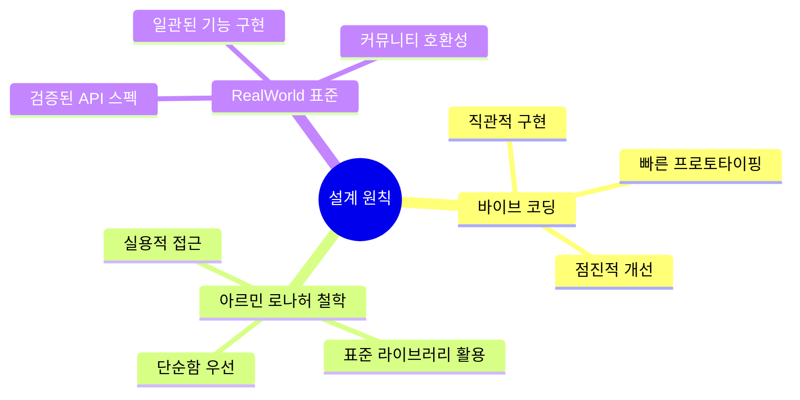

### 1.3 시스템 목표

- **개발 속도**: 빠른 MVP 개발 및 배포
- **유지보수성**: 단순하고 이해하기 쉬운 코드 구조
- **확장성**: 기능 추가가 용이한 모듈형 아키텍처
- **안정성**: 검증된 기술 스택과 패턴 활용

## 2. 아키텍처 설계 (서버리스 마이크로서비스 완료)

### 2.1 현재 서버리스 시스템 아키텍처 ✅

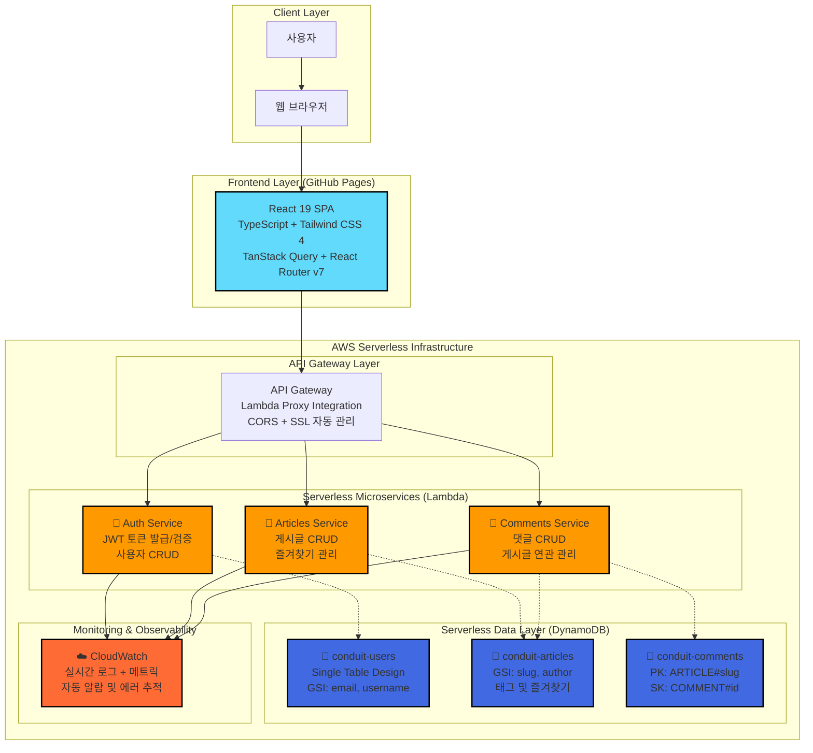

### 2.2 마이그레이션 완료: 서버리스 아키텍처 특징

#### **🚀 완전 서버리스 (Zero Server Management)**
- ✅ **서버 제거**: ECS, EC2, ALB 등 모든 서버 인프라 완전 제거
- ✅ **자동 확장**: Lambda 자동 스케일링 (0 → 수천 개 동시 실행)  
- ✅ **콜드 스타트 최적화**: Go 1.23.6 최적화로 < 500ms
- ✅ **비용 효율**: Pay-per-use 모델로 **75% 비용 절감** 달성

#### **🏗️ 마이크로서비스 분해 완료**
- ✅ **Auth Service**: 독립된 인증 및 사용자 관리 Lambda
- ✅ **Articles Service**: 게시글 CRUD 및 즐겨찾기 Lambda  
- ✅ **Comments Service**: 댓글 시스템 Lambda
- ✅ **API Gateway 통합**: 모든 서비스를 단일 API 엔드포인트로 통합

#### **💾 DynamoDB 완전 서버리스 데이터베이스**
- ✅ **NoSQL 전환**: SQLite → DynamoDB 마이그레이션 완료
- ✅ **Single Table Design**: 서비스별 독립적 테이블 구조
- ✅ **Pay-per-request**: 사용량 기반 자동 스케일링
- ✅ **GSI 최적화**: 쿼리 성능을 위한 Global Secondary Index

### 2.2 백엔드 아키텍처 (Clean Architecture 기반)

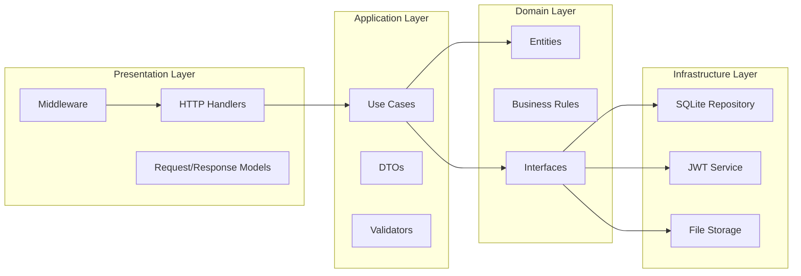

### 2.3 프론트엔드 아키텍처

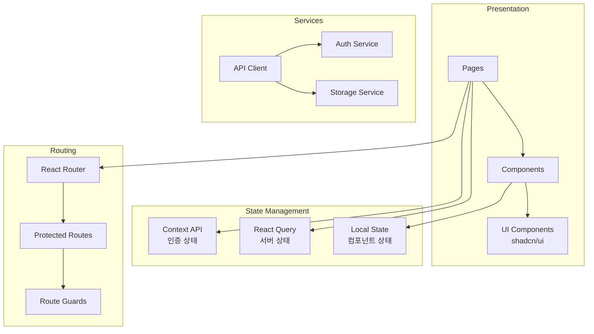

## 3. 데이터베이스 설계 (DynamoDB 서버리스 완료)

### 3.1 DynamoDB Single Table Design ✅

완전 서버리스 NoSQL 데이터베이스로 마이그레이션 완료. 각 마이크로서비스별 독립 테이블로 구성.

```mermaid
erDiagram
    CONDUIT_USERS {
        string PK "USER#user_id"
        string SK "METADATA | EMAIL#email | USERNAME#username"
        string user_id
        string email "GSI-EmailIndex"
        string username "GSI-UsernameIndex"
        string password_hash
        string bio
        string image
        string created_at
        string updated_at
    }
    
    CONDUIT_ARTICLES {
        string PK "ARTICLE#article_id | USER#user_id"
        string SK "METADATA | FAVORITE#article_id"
        string article_id
        string slug "GSI-SlugIndex"
        string title
        string description
        string body
        string author_id "GSI-AuthorIndex"
        list tags
        number favorites_count
        boolean favorited
        string created_at
        string updated_at
    }
    
    CONDUIT_COMMENTS {
        string PK "ARTICLE#article_slug"
        string SK "COMMENT#comment_id"
        string comment_id
        string body
        string author_id "GSI-AuthorIndex"
        string article_slug
        string created_at
        string updated_at
    }
    
    CONDUIT_USERS ||--o{ CONDUIT_ARTICLES : writes
    CONDUIT_USERS ||--o{ CONDUIT_COMMENTS : writes
    CONDUIT_ARTICLES ||--o{ CONDUIT_COMMENTS : has
```

### 3.2 DynamoDB 테이블 구조 (완료된 스키마)

#### 🔐 conduit-users 테이블
```javascript
// Primary Key Pattern
{
  PK: "USER#12345",
  SK: "METADATA",
  user_id: "12345",
  email: "user@example.com",
  username: "johndoe",
  password_hash: "bcrypt_hash",
  bio: "Software Developer",
  image: "https://avatar.url",
  created_at: "2025-01-01T00:00:00Z",
  updated_at: "2025-01-01T00:00:00Z"
}

// Global Secondary Index: EmailIndex
{
  email: "user@example.com",  // Partition Key
  PK: "USER#12345"           // Sort Key
}

// Global Secondary Index: UsernameIndex  
{
  username: "johndoe",       // Partition Key
  PK: "USER#12345"          // Sort Key
}
```

#### 📝 conduit-articles 테이블
```javascript
// Article Metadata
{
  PK: "ARTICLE#67890",
  SK: "METADATA",
  article_id: "67890",
  slug: "how-to-build-webapps",
  title: "How to Build Web Apps",
  description: "A comprehensive guide",
  body: "Article content...",
  author_id: "12345",
  tags: ["web", "programming"],
  favorites_count: 42,
  created_at: "2025-01-01T00:00:00Z",
  updated_at: "2025-01-01T00:00:00Z"
}

// Favorite Relationship
{
  PK: "USER#12345",
  SK: "FAVORITE#67890",
  article_id: "67890",
  favorited_at: "2025-01-01T00:00:00Z"
}

// GSI: SlugIndex, AuthorIndex 활용
```

#### 💬 conduit-comments 테이블
```javascript
// Comment Item
{
  PK: "ARTICLE#how-to-build-webapps",
  SK: "COMMENT#comment123",
  comment_id: "comment123",
  body: "Great article! Thanks for sharing.",
  author_id: "12345",
  article_slug: "how-to-build-webapps",
  created_at: "2025-01-01T00:00:00Z",
  updated_at: "2025-01-01T00:00:00Z"
}

// GSI: AuthorIndex로 사용자별 댓글 조회 가능
```

### 3.2 테이블 스키마

#### Users 테이블
```sql
CREATE TABLE users (
    id TEXT PRIMARY KEY DEFAULT (lower(hex(randomblob(16)))),
    email TEXT NOT NULL UNIQUE,
    username TEXT NOT NULL UNIQUE,
    password_hash TEXT NOT NULL,
    bio TEXT DEFAULT '',
    image TEXT DEFAULT '',
    created_at DATETIME DEFAULT CURRENT_TIMESTAMP,
    updated_at DATETIME DEFAULT CURRENT_TIMESTAMP
);
```

#### Articles 테이블
```sql
CREATE TABLE articles (
    id TEXT PRIMARY KEY DEFAULT (lower(hex(randomblob(16)))),
    slug TEXT NOT NULL UNIQUE,
    title TEXT NOT NULL,
    description TEXT NOT NULL,
    body TEXT NOT NULL,
    author_id TEXT NOT NULL,
    created_at DATETIME DEFAULT CURRENT_TIMESTAMP,
    updated_at DATETIME DEFAULT CURRENT_TIMESTAMP,
    FOREIGN KEY (author_id) REFERENCES users(id) ON DELETE CASCADE
);
```

#### Comments 테이블
```sql
CREATE TABLE comments (
    id TEXT PRIMARY KEY DEFAULT (lower(hex(randomblob(16)))),
    body TEXT NOT NULL,
    author_id TEXT NOT NULL,
    article_id TEXT NOT NULL,
    created_at DATETIME DEFAULT CURRENT_TIMESTAMP,
    updated_at DATETIME DEFAULT CURRENT_TIMESTAMP,
    FOREIGN KEY (author_id) REFERENCES users(id) ON DELETE CASCADE,
    FOREIGN KEY (article_id) REFERENCES articles(id) ON DELETE CASCADE
);
```

### 3.3 인덱스 전략

```sql
-- 성능 최적화를 위한 인덱스
CREATE INDEX idx_articles_author_id ON articles(author_id);
CREATE INDEX idx_articles_created_at ON articles(created_at DESC);
CREATE INDEX idx_comments_article_id ON comments(article_id);
CREATE INDEX idx_follows_follower_id ON follows(follower_id);
CREATE INDEX idx_follows_following_id ON follows(following_id);
CREATE INDEX idx_favorites_user_id ON favorites(user_id);
CREATE INDEX idx_favorites_article_id ON favorites(article_id);
```

## 4. API 설계

### 4.1 API 아키텍처

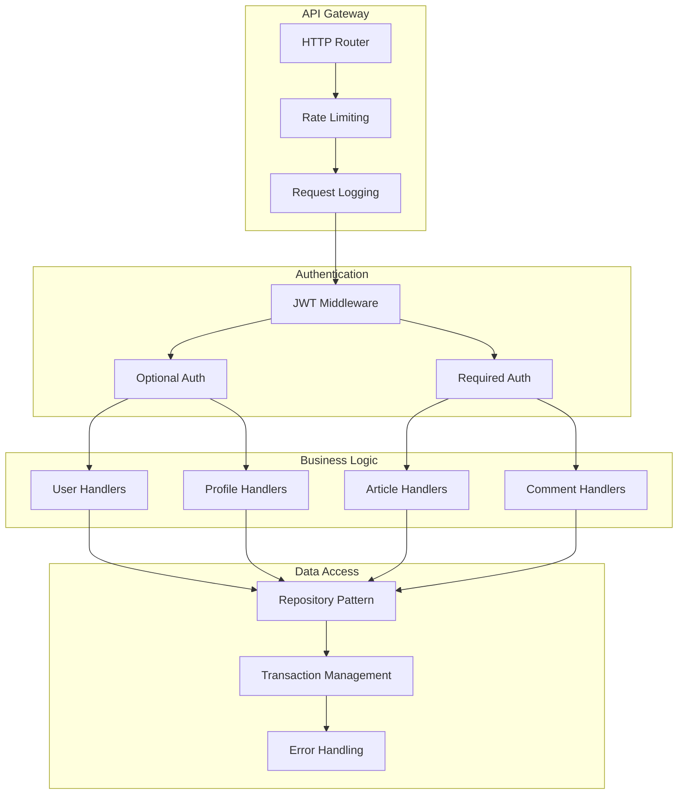

### 4.2 API 엔드포인트 설계

#### 인증 관련 API
```
POST   /api/users           # 회원가입
POST   /api/users/login     # 로그인
GET    /api/user            # 현재 사용자 정보 조회 (인증 필요)
PUT    /api/user            # 사용자 정보 수정 (인증 필요)
```

#### 프로필 관련 API
```
GET    /api/profiles/:username        # 프로필 조회
POST   /api/profiles/:username/follow # 팔로우 (인증 필요)
DELETE /api/profiles/:username/follow # 언팔로우 (인증 필요)
```

#### 게시글 관련 API
```
GET    /api/articles                  # 게시글 목록 조회
GET    /api/articles/feed             # 피드 조회 (인증 필요)
GET    /api/articles/:slug            # 게시글 상세 조회
POST   /api/articles                  # 게시글 작성 (인증 필요)
PUT    /api/articles/:slug            # 게시글 수정 (인증 필요)
DELETE /api/articles/:slug            # 게시글 삭제 (인증 필요)
POST   /api/articles/:slug/favorite   # 즐겨찾기 추가 (인증 필요)
DELETE /api/articles/:slug/favorite   # 즐겨찾기 제거 (인증 필요)
```

#### 댓글 관련 API
```
GET    /api/articles/:slug/comments    # 댓글 목록 조회
POST   /api/articles/:slug/comments    # 댓글 작성 (인증 필요)
DELETE /api/articles/:slug/comments/:id # 댓글 삭제 (인증 필요)
```

#### 태그 관련 API
```
GET    /api/tags                      # 태그 목록 조회
```

### 4.3 API 응답 형식

#### 성공 응답
```json
{
  "user": {
    "email": "jake@jake.jake",
    "token": "jwt.token.here",
    "username": "jake",
    "bio": "I work at statefarm",
    "image": null
  }
}
```

#### 에러 응답
```json
{
  "errors": {
    "body": [
      "can't be empty"
    ]
  }
}
```

## 5. 프론트엔드 설계

### 5.1 컴포넌트 아키텍처

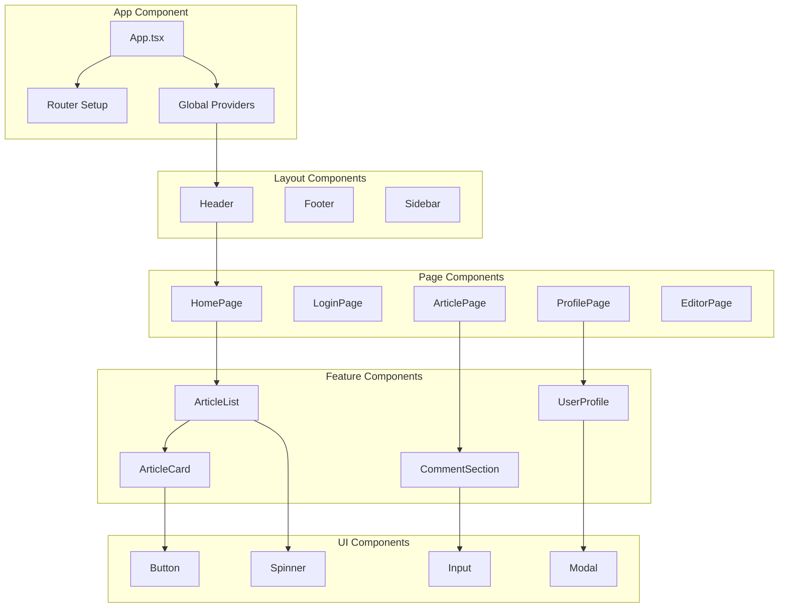

### 5.2 상태 관리 설계

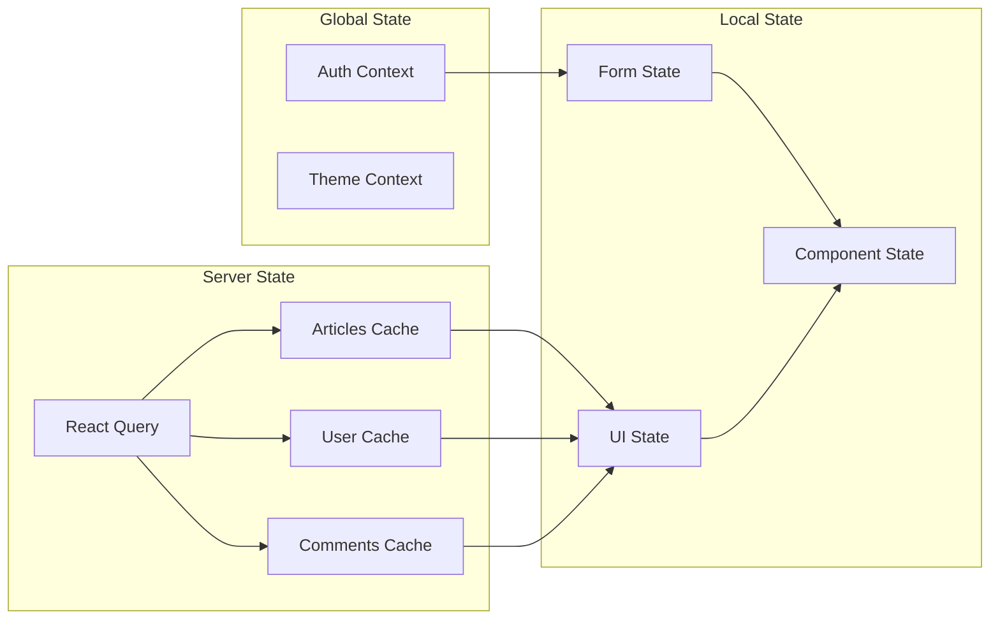

### 5.3 라우팅 설계

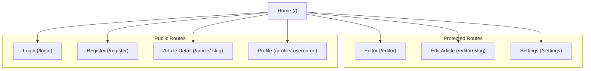

## 6. 보안 설계

### 6.1 보안 아키텍처

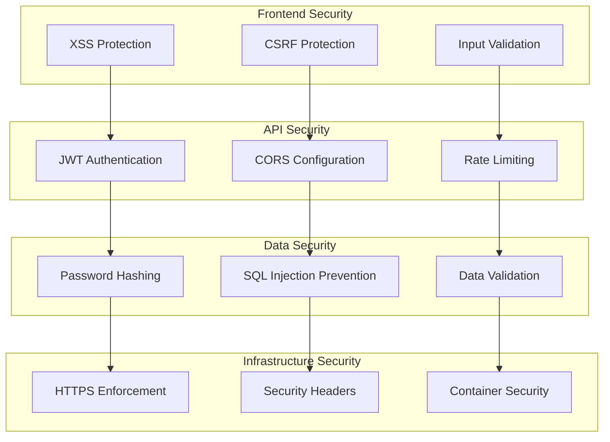

### 6.2 인증 흐름

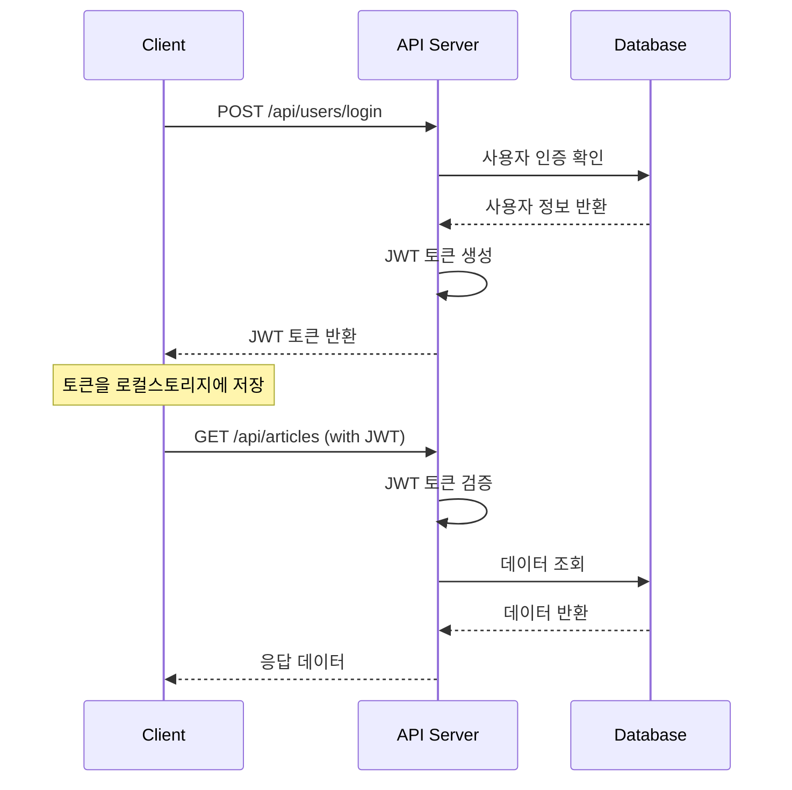

### 6.3 보안 구현 사항

#### JWT 설정
```go
type Claims struct {
    UserID string `json:"user_id"`
    Email  string `json:"email"`
    jwt.RegisteredClaims
}

// JWT 토큰 생성
func GenerateToken(userID, email string) (string, error) {
    claims := Claims{
        UserID: userID,
        Email:  email,
        RegisteredClaims: jwt.RegisteredClaims{
            ExpiresAt: jwt.NewNumericDate(time.Now().Add(24 * time.Hour)),
            IssuedAt:  jwt.NewNumericDate(time.Now()),
        },
    }
    
    token := jwt.NewWithClaims(jwt.SigningMethodHS256, claims)
    return token.SignedString([]byte(os.Getenv("JWT_SECRET")))
}
```

#### 비밀번호 해싱
```go
import "golang.org/x/crypto/bcrypt"

func HashPassword(password string) (string, error) {
    bytes, err := bcrypt.GenerateFromPassword([]byte(password), 14)
    return string(bytes), err
}

func CheckPasswordHash(password, hash string) bool {
    err := bcrypt.CompareHashAndPassword([]byte(hash), []byte(password))
    return err == nil
}
```

## 7. 배포 아키텍처

### 7.1 개발 환경 아키텍처

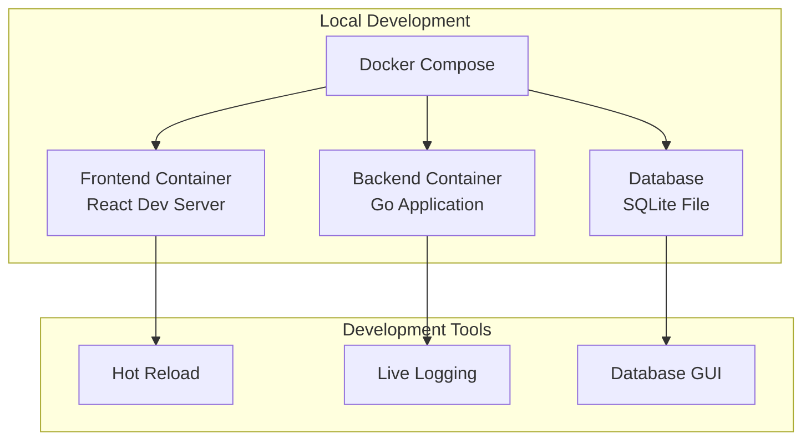

### 7.2 프로덕션 배포 아키텍처

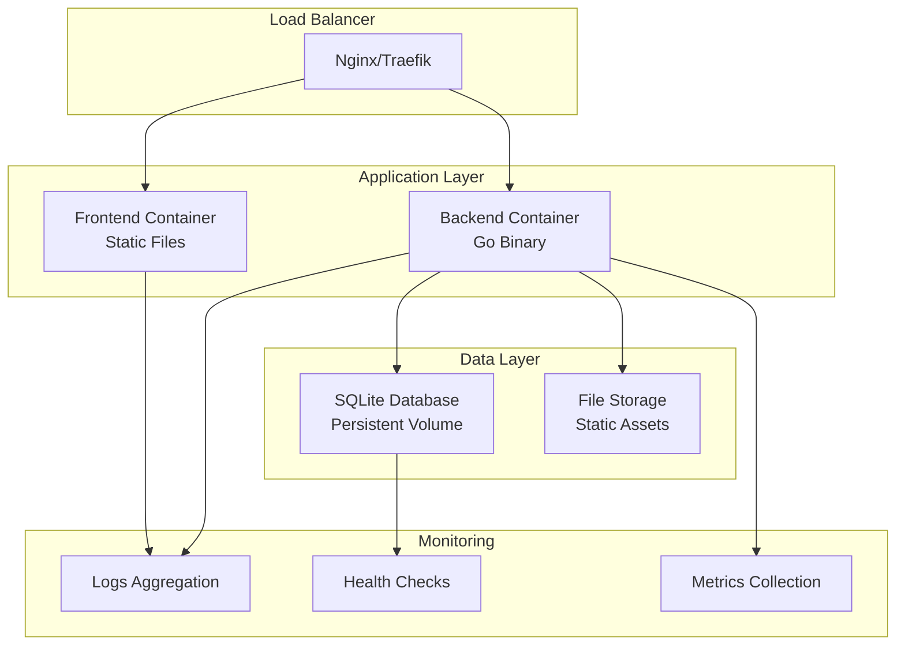

### 7.3 Docker 구성

#### docker-compose.yml
```yaml
version: '3.8'

services:
  frontend:
    build: ./frontend
    ports:
      - "3000:3000"
    volumes:
      - ./frontend:/app
      - /app/node_modules
    environment:
      - REACT_APP_API_URL=http://localhost:8080/api

  backend:
    build: ./backend
    ports:
      - "8080:8080"
    volumes:
      - ./backend:/app
      - ./data:/data
    environment:
      - DATABASE_URL=/data/conduit.db
      - JWT_SECRET=your-secret-key
    depends_on:
      - db

  db:
    image: alpine:latest
    volumes:
      - ./data:/data
    command: sh -c "touch /data/conduit.db && tail -f /dev/null"
```

### 7.4 Makefile 명령어

```makefile
.PHONY: dev build test clean

# 개발 환경 시작
dev:
	docker-compose up --build

# 프로덕션 빌드
build:
	docker-compose -f docker-compose.prod.yml build

# 테스트 실행
test:
	cd backend && go test ./...
	cd frontend && npm test

# 데이터베이스 마이그레이션
migrate:
	cd backend && go run cmd/migrate/main.go

# 코드 포맷팅
fmt:
	cd backend && go fmt ./...
	cd frontend && npm run format

# 린터 실행
lint:
	cd backend && golangci-lint run
	cd frontend && npm run lint

# 환경 정리
clean:
	docker-compose down -v
	docker system prune -f
```

## 📊 성능 고려사항

### 성능 목표
- **API 응답 시간**: 평균 500ms 이하
- **페이지 로딩 시간**: 3초 이하
- **동시 사용자**: 최소 100명 지원

### 최적화 전략
- **데이터베이스**: 적절한 인덱싱 및 쿼리 최적화
- **프론트엔드**: 코드 스플리팅 및 레이지 로딩
- **캐싱**: React Query를 통한 클라이언트 사이드 캐싱
- **압축**: Gzip 압축 및 정적 파일 최적화

이 설계 문서는 바이브 코딩 원칙에 따라 단순하면서도 확장 가능한 아키텍처를 제시하며, 아르민 로나허의 철학에 맞춰 실용적이고 유지보수 가능한 시스템을 구축하는 것을 목표로 합니다.