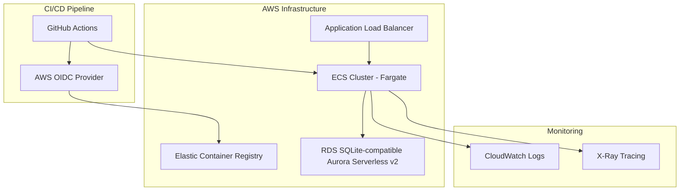
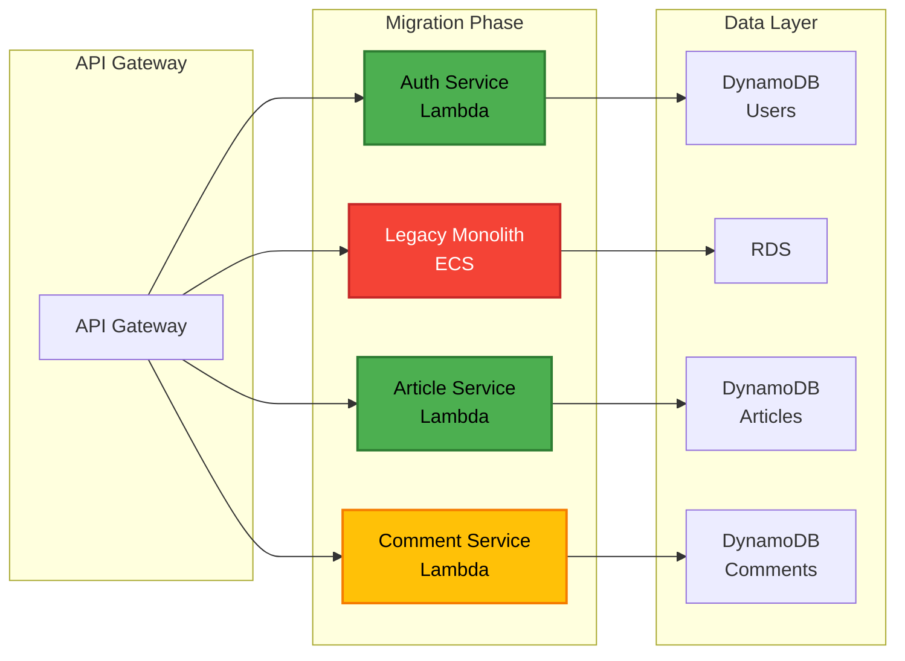
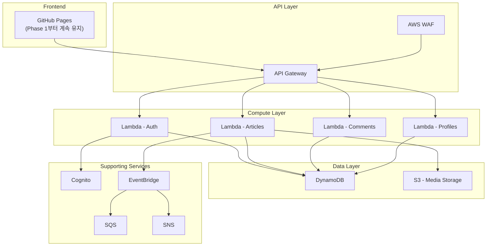

# 모노리식에서 서버리스 마이크로서비스로 마이그레이션 PRD

## 1. 프로젝트 개요

### 1.1 프로젝트명
**Conduit Migration** - RealWorld 애플리케이션의 서버리스 마이크로서비스 전환 프로젝트

### 1.2 프로젝트 목적
- 바이브 코딩 방법론을 활용한 점진적 마이그레이션 학습
- 모노리식 아키텍처에서 AWS 서버리스 마이크로서비스로의 실전 전환 경험
- 빠르고 안정적인 MVP 구현을 통한 실무 역량 강화

### 1.3 프로젝트 범위
- **Phase 1**: 기존 모노리식 백엔드를 AWS ECS + Fargate로 배포, 프론트엔드는 GitHub Pages로 배포
- **Phase 2**: 백엔드만 스트랭글러 패턴을 활용한 서버리스 마이크로서비스로 전환 (프론트엔드는 GitHub Pages 유지)

### 1.4 핵심 요구사항
- MVP 수준의 최소한의 구현으로 빠른 가치 창출
- 속도와 품질의 균형 유지
- 실무에서 활용 가능한 배포 파이프라인 구축

## 2. Phase 1: AWS와 GitHub Pages 배포

### 2.1 백엔드 배포 아키텍처

#### 2.1.1 인프라 구성


#### 2.1.2 기술 스택
- **컨테이너화**: Docker 기반 Go 애플리케이션
- **오케스트레이션**: AWS ECS with Fargate
- **IaC**: AWS CDK (TypeScript)
- **데이터베이스**: RDS Aurora Serverless v2 (SQLite 호환 모드) 또는 EFS 마운트 SQLite
- **로드 밸런싱**: Application Load Balancer (ALB)

#### 2.1.3 배포 파이프라인
```yaml
# .github/workflows/backend-deploy.yml
name: Deploy Backend to ECS
on:
  push:
    branches: [main]
    paths:
      - 'backend/**'
      - '.github/workflows/backend-deploy.yml'

jobs:
  deploy:
    runs-on: ubuntu-latest
    permissions:
      id-token: write
      contents: read
    
    steps:
      - uses: actions/checkout@v4
      
      - name: Configure AWS credentials
        uses: aws-actions/configure-aws-credentials@v4
        with:
          role-to-assume: ${{ secrets.AWS_ROLE_ARN }}
          aws-region: ap-northeast-2
      
      - name: Login to Amazon ECR
        id: login-ecr
        uses: aws-actions/amazon-ecr-login@v2
      
      - name: Build and push Docker image
        env:
          ECR_REGISTRY: ${{ steps.login-ecr.outputs.registry }}
          ECR_REPOSITORY: conduit-backend
          IMAGE_TAG: ${{ github.sha }}
        run: |
          cd backend
          docker build -t $ECR_REGISTRY/$ECR_REPOSITORY:$IMAGE_TAG .
          docker push $ECR_REGISTRY/$ECR_REPOSITORY:$IMAGE_TAG
      
      - name: Deploy to ECS
        run: |
          aws ecs update-service \
            --cluster conduit-cluster \
            --service conduit-backend \
            --force-new-deployment
      
      - name: Get Load Balancer URL
        id: get-alb-url
        run: |
          ALB_URL=$(aws elbv2 describe-load-balancers \
            --names conduit-alb \
            --query 'LoadBalancers[0].DNSName' \
            --output text)
          echo "alb_url=https://${ALB_URL}" >> $GITHUB_OUTPUT
      
      - name: Update GitHub Variable
        env:
          GH_TOKEN: ${{ secrets.GITHUB_TOKEN }}
        run: |
          gh variable set BACKEND_API_URL \
            --body "${{ steps.get-alb-url.outputs.alb_url }}" \
            --repo ${{ github.repository }}
```

#### 2.1.4 AWS CDK 구성
```typescript
// infrastructure/lib/backend-stack.ts
import * as cdk from 'aws-cdk-lib';
import * as ecs from 'aws-cdk-lib/aws-ecs';
import * as ecr from 'aws-cdk-lib/aws-ecr';
import * as iam from 'aws-cdk-lib/aws-iam';
import * as elbv2 from 'aws-cdk-lib/aws-elasticloadbalancingv2';

export class BackendStack extends cdk.Stack {
  constructor(scope: Construct, id: string, props?: cdk.StackProps) {
    super(scope, id, props);

    // ECR Repository
    const repository = new ecr.Repository(this, 'ConduitBackendRepo', {
      repositoryName: 'conduit-backend',
      lifecycleRules: [{
        maxImageCount: 10
      }]
    });

    // ECS Cluster
    const cluster = new ecs.Cluster(this, 'ConduitCluster', {
      clusterName: 'conduit-cluster',
      containerInsights: true
    });

    // Fargate Task Definition
    const taskDefinition = new ecs.FargateTaskDefinition(this, 'ConduitTaskDef', {
      memoryLimitMiB: 512,
      cpu: 256
    });

    // Container
    const container = taskDefinition.addContainer('conduit-backend', {
      image: ecs.ContainerImage.fromEcrRepository(repository),
      logging: ecs.LogDrivers.awsLogs({
        streamPrefix: 'conduit-backend'
      }),
      environment: {
        PORT: '8080',
        DATABASE_URL: '/data/conduit.db'
      }
    });

    container.addPortMappings({
      containerPort: 8080,
      protocol: ecs.Protocol.TCP
    });

    // ALB
    const alb = new elbv2.ApplicationLoadBalancer(this, 'ConduitALB', {
      vpc: cluster.vpc,
      internetFacing: true,
      loadBalancerName: 'conduit-alb'
    });

    // Fargate Service
    const service = new ecs.FargateService(this, 'ConduitService', {
      cluster,
      taskDefinition,
      serviceName: 'conduit-backend',
      desiredCount: 2,
      assignPublicIp: true
    });

    // ALB Target Group
    const targetGroup = new elbv2.ApplicationTargetGroup(this, 'ConduitTargetGroup', {
      vpc: cluster.vpc,
      port: 8080,
      protocol: elbv2.ApplicationProtocol.HTTP,
      targets: [service],
      healthCheck: {
        path: '/api/health',
        interval: cdk.Duration.seconds(30)
      }
    });

    // ALB Listener
    alb.addListener('Listener', {
      port: 443,
      certificates: [/* SSL 인증서 */],
      defaultTargetGroups: [targetGroup]
    });

    // OIDC Provider for GitHub Actions
    new iam.OpenIdConnectProvider(this, 'GitHubOIDC', {
      url: 'https://token.actions.githubusercontent.com',
      clientIds: ['sts.amazonaws.com']
    });
  }
}
```

#### 2.1.5 API 테스트 전략
- **프레임워크**: Go testing + Testify (Perplexity 조사 결과 기반)
- **테스트 범위**: 
  - 모든 RealWorld API 엔드포인트
  - JWT 인증 플로우
  - 에러 핸들링
- **CI 통합**: GitHub Actions에서 자동 실행

```go
// backend/internal/handlers/handlers_test.go
func TestArticleEndpoints(t *testing.T) {
    // JWT 토큰 생성
    token := generateTestJWT()
    
    tests := []struct {
        name       string
        method     string
        path       string
        body       interface{}
        wantStatus int
        auth       bool
    }{
        {
            name:       "List Articles",
            method:     "GET",
            path:       "/api/articles",
            wantStatus: http.StatusOK,
            auth:       false,
        },
        {
            name:       "Create Article",
            method:     "POST",
            path:       "/api/articles",
            body:       validArticlePayload(),
            wantStatus: http.StatusCreated,
            auth:       true,
        },
    }
    
    for _, tt := range tests {
        t.Run(tt.name, func(t *testing.T) {
            req := httptest.NewRequest(tt.method, tt.path, toReader(tt.body))
            if tt.auth {
                req.Header.Set("Authorization", "Bearer "+token)
            }
            
            w := httptest.NewRecorder()
            router.ServeHTTP(w, req)
            
            assert.Equal(t, tt.wantStatus, w.Code)
        })
    }
}
```

### 2.2 프론트엔드 배포 아키텍처

#### 2.2.1 GitHub Pages 배포
```yaml
# .github/workflows/frontend-deploy.yml
name: Deploy Frontend to GitHub Pages
on:
  push:
    branches: [main]
    paths:
      - 'frontend/**'
      - '.github/workflows/frontend-deploy.yml'

jobs:
  build-and-deploy:
    runs-on: ubuntu-latest
    permissions:
      contents: read
      pages: write
      id-token: write
    
    steps:
      - uses: actions/checkout@v4
      
      - name: Setup Node.js
        uses: actions/setup-node@v4
        with:
          node-version: '20'
          cache: 'npm'
          cache-dependency-path: frontend/package-lock.json
      
      - name: Install dependencies
        run: |
          cd frontend
          npm ci
      
      - name: Build with backend URL
        env:
          VITE_API_URL: ${{ vars.BACKEND_API_URL }}
        run: |
          cd frontend
          npm run build
      
      - name: Setup Pages
        uses: actions/configure-pages@v4
      
      - name: Upload artifact
        uses: actions/upload-pages-artifact@v3
        with:
          path: 'frontend/dist'
      
      - name: Deploy to GitHub Pages
        id: deployment
        uses: actions/deploy-pages@v4
```

#### 2.2.2 E2E 테스트 구성
```yaml
# .github/workflows/e2e-tests.yml
name: E2E Tests
on:
  workflow_run:
    workflows: ["Deploy Backend to ECS", "Deploy Frontend to GitHub Pages"]
    types:
      - completed

jobs:
  e2e-tests:
    if: ${{ github.event.workflow_run.conclusion == 'success' }}
    runs-on: ubuntu-latest
    
    steps:
      - uses: actions/checkout@v4
      
      - name: Setup Node.js
        uses: actions/setup-node@v4
        with:
          node-version: '20'
      
      - name: Install Playwright
        run: |
          cd frontend
          npm ci
          npx playwright install --with-deps
      
      - name: Run E2E tests
        env:
          BASE_URL: ${{ vars.FRONTEND_URL }}
          API_URL: ${{ vars.BACKEND_API_URL }}
        run: |
          cd frontend
          npm run test:e2e
      
      - name: Upload test results
        if: always()
        uses: actions/upload-artifact@v4
        with:
          name: playwright-report
          path: frontend/playwright-report/
```

### 2.3 Phase 1 구현 작업 목록

#### 2.3.1 인프라 설정
- [ ] AWS 계정 및 IAM 설정
- [ ] GitHub OIDC Provider 구성
- [ ] AWS CDK 프로젝트 초기화
- [ ] ECS/Fargate 스택 구현
- [ ] ECR 리포지토리 생성

#### 2.3.2 백엔드 배포
- [ ] Dockerfile 최적화
- [ ] 헬스체크 엔드포인트 추가
- [ ] 환경변수 기반 설정
- [ ] GitHub Actions 워크플로우 구성
- [ ] API 테스트 스위트 구축

#### 2.3.3 프론트엔드 배포
- [ ] 빌드 최적화 설정
- [ ] 환경변수 주입 구성
- [ ] GitHub Pages 설정
- [ ] Playwright E2E 테스트 작성

## 3. Phase 2: 서버리스 마이크로서비스 마이그레이션

### 3.1 마이그레이션 전략

#### 3.1.1 스트랭글러 패턴 적용


#### 3.1.2 마이크로서비스 분해 계획
1. **인증 서비스** (Phase 2.1)
   - 사용자 관리
   - JWT 토큰 발급/검증
   - 프로필 관리

2. **게시글 서비스** (Phase 2.2)
   - 게시글 CRUD
   - 태그 관리
   - 즐겨찾기 기능

3. **댓글 서비스** (Phase 2.3)
   - 댓글 CRUD
   - 댓글 조회

4. **팔로우 서비스** (Phase 2.4)
   - 팔로우/언팔로우
   - 피드 생성

### 3.2 서버리스 아키텍처

#### 3.2.1 AWS 서비스 구성


#### 3.2.2 DynamoDB 테이블 설계
```yaml
# Users Table
PK: USER#<user_id>
SK: PROFILE
Attributes:
  - email
  - username
  - passwordHash
  - bio
  - image
  - createdAt
  - updatedAt

# Articles Table
PK: ARTICLE#<article_id>
SK: METADATA
GSI1PK: USER#<author_id>
GSI1SK: ARTICLE#<created_at>
Attributes:
  - slug
  - title
  - description
  - body
  - tagList
  - favoritesCount
  - createdAt
  - updatedAt

# Comments Table
PK: ARTICLE#<article_id>
SK: COMMENT#<comment_id>
GSI1PK: USER#<author_id>
GSI1SK: COMMENT#<created_at>
Attributes:
  - body
  - createdAt
  - updatedAt
```

### 3.3 Phase 2 구현 계획 (바이브 코딩 - 1일 완성)

#### 3.3.1 인증 서비스
- [ ] Cognito 사용자 풀 설정
- [ ] Lambda 함수 구현 (회원가입/로그인)
- [ ] JWT 토큰 마이그레이션
- [ ] API Gateway 라우팅 설정
- [ ] 기존 시스템과의 동기화
- [ ] 프론트엔드 API 엔드포인트 업데이트 (GitHub Variable 수정)

#### 3.3.2 게시글 서비스
- [ ] DynamoDB 테이블 생성
- [ ] 데이터 마이그레이션 스크립트
- [ ] Lambda 함수 구현 (CRUD)
- [ ] S3 미디어 스토리지 설정
- [ ] EventBridge 이벤트 발행
- [ ] 프론트엔드 환경변수 확인 (API Gateway URL 사용)

#### 3.3.3 댓글 서비스
- [ ] DynamoDB 스키마 구현
- [ ] Lambda 함수 개발
- [ ] 게시글 서비스와 통합
- [ ] 성능 최적화

#### 3.3.4 모노리스 폐기
- [ ] 트래픽 전환 완료
- [ ] 모니터링 및 알람 설정
- [ ] ECS 서비스 종료
- [ ] 비용 최적화
- [ ] 프론트엔드 최종 동작 확인 (GitHub Pages에서 서버리스 백엔드 호출)

### 3.4 프론트엔드 통합 전략

#### 3.4.1 API 엔드포인트 전환
- **Phase 1**: `VITE_API_URL` = ECS ALB URL (예: https://conduit-alb.region.elb.amazonaws.com)
- **Phase 2**: `VITE_API_URL` = API Gateway URL (예: https://api-id.execute-api.region.amazonaws.com/prod)
- GitHub Variable을 통한 중앙 관리로 재배포 없이 엔드포인트 전환

#### 3.4.2 프론트엔드 수정 사항
- 백엔드 API 엔드포인트 변경 외 추가 수정 없음
- GitHub Pages 배포 파이프라인 그대로 유지
- E2E 테스트에서 새로운 API Gateway URL 사용

### 3.5 모니터링 및 운영

#### 3.5.1 관찰성 스택
```yaml
Monitoring:
  - CloudWatch Logs: 모든 Lambda 함수 로그
  - X-Ray: 분산 추적
  - CloudWatch Metrics: 커스텀 메트릭
  - CloudWatch Alarms: 임계값 기반 알람

Dashboards:
  - API 성능 대시보드
  - 비용 모니터링 대시보드
  - 사용자 활동 대시보드
```

#### 3.5.2 비용 최적화
- Lambda 예약 동시성 설정
- DynamoDB On-Demand → Provisioned 전환
- S3 라이프사이클 정책
- GitHub Pages는 무료 호스팅 계속 활용

## 4. 리스크 및 완화 전략

### 4.1 기술적 리스크
| 리스크 | 영향도 | 완화 전략 |
|--------|--------|-----------|
| 데이터 마이그레이션 실패 | 높음 | 듀얼 라이트 전략, 롤백 계획 |
| 성능 저하 | 중간 | 점진적 트래픽 전환, 로드 테스트 |
| 비용 초과 | 중간 | 일일 비용 모니터링, 예산 알람 |
| 보안 취약점 | 높음 | AWS Security Hub, 정기 감사 |

### 4.2 일정 리스크
- MVP 범위 엄격 관리
- 주간 진행상황 체크포인트
- 블로커 사항 즉시 에스컬레이션

## 5. 성공 지표

### 5.1 Phase 1 성공 기준
- [ ] 백엔드 API 99% 가용성
- [ ] 배포 시간 < 10분
- [ ] 모든 RealWorld API 테스트 통과
- [ ] E2E 테스트 성공률 > 95%

### 5.2 Phase 2 성공 기준
- [ ] 서버리스 전환 완료
- [ ] 응답 시간 < 200ms (p99)
- [ ] 운영 비용 30% 절감
- [ ] 무중단 마이그레이션 달성

## 6. 질문 및 추가 확인 사항

### 6.1 기술적 결정 사항
1. **데이터베이스 선택**: Phase 1에서 RDS Aurora Serverless v2를 사용할지, EFS에 SQLite를 마운트할지 결정이 필요합니다. 각각의 장단점은:
   - RDS Aurora Serverless v2: 관리형 서비스, 자동 스케일링, 높은 비용
   - EFS + SQLite: 낮은 비용, 직접 관리 필요, 동시성 제한

2. **인증 전략**: Phase 2에서 Cognito를 사용할지, 자체 JWT 구현을 유지할지 결정이 필요합니다.

3. **프론트엔드 호스팅**: GitHub Pages를 계속 사용하므로 추가 CDN은 불필요합니다. GitHub Pages는 이미 Fastly CDN을 통해 제공됩니다.

### 6.2 운영 관련 사항
1. **도메인**: 커스텀 도메인 사용 여부와 SSL 인증서 준비 상태
2. **환경 분리**: 개발/스테이징/프로덕션 환경 분리 전략
3. **백업 정책**: 데이터 백업 및 복구 전략

### 6.3 팀 구성 및 역할
1. **AWS 계정 관리자**: IAM 권한 및 비용 관리 담당자
2. **모니터링 담당**: 알람 및 대시보드 관리 담당자
3. **보안 검토**: 보안 정책 및 컴플라이언스 담당자

---

이 PRD는 바이브 코딩 방법론에 따라 빠른 MVP 구현과 점진적 개선에 중점을 두고 작성되었습니다. Phase 1에서 안정적인 배포 파이프라인을 구축하고, Phase 2에서 백엔드만 서버리스로 전환하여 확장성과 비용 효율성을 달성하는 것을 목표로 합니다. 프론트엔드는 전체 마이그레이션 과정에서 GitHub Pages를 계속 사용하며, 백엔드 API 엔드포인트 변경만 수행합니다.