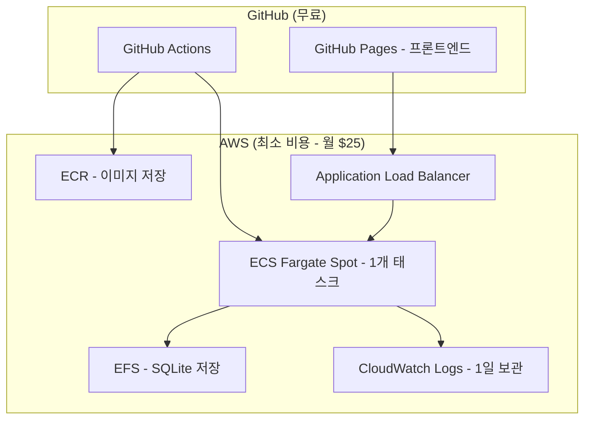
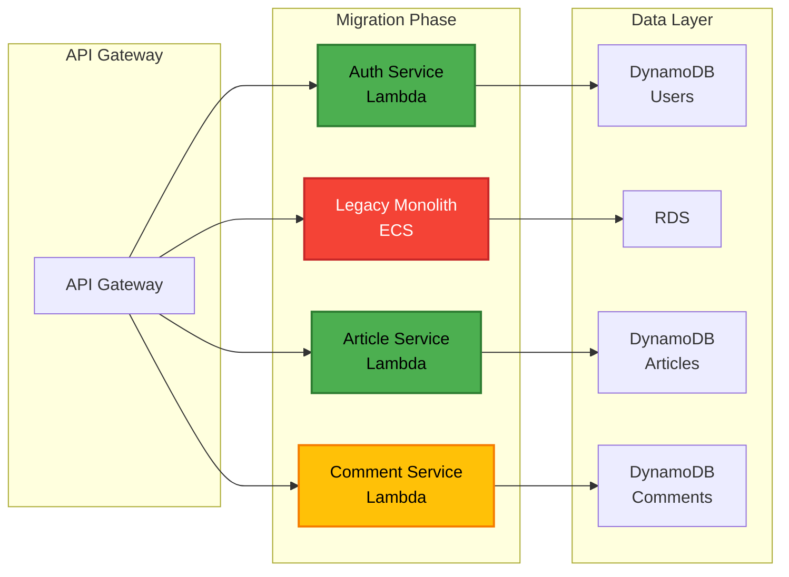
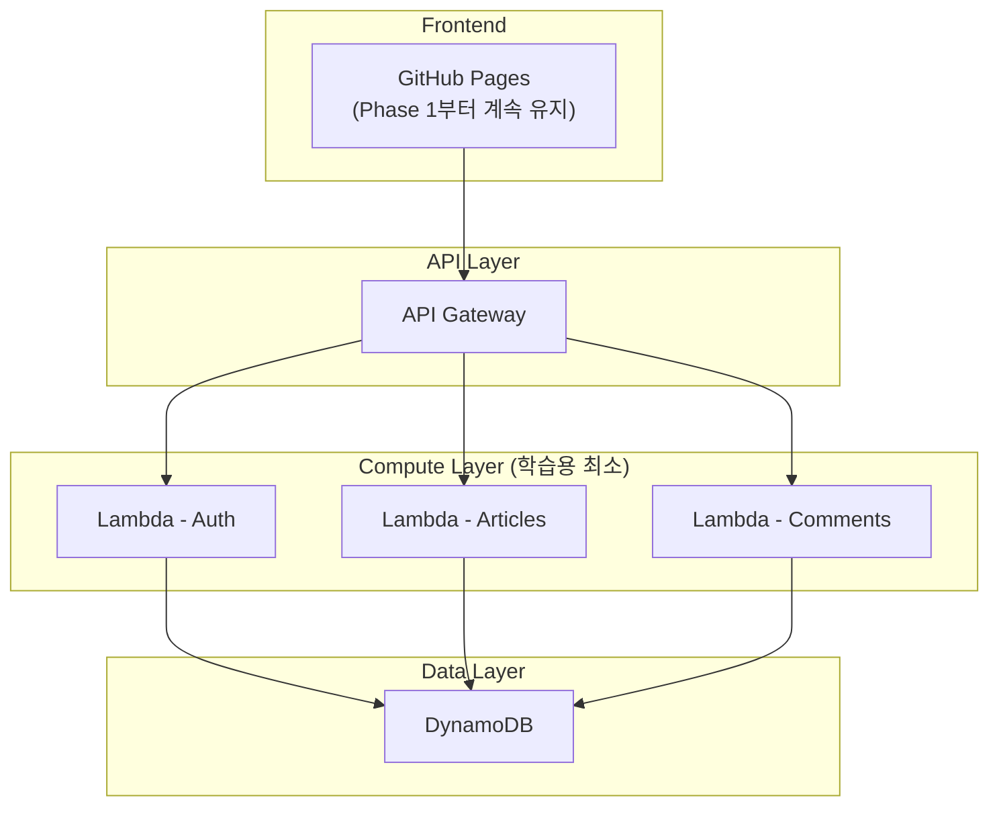

# 모노리식에서 서버리스 마이크로서비스로 마이그레이션 PRD

## 1. 프로젝트 개요

### 1.1 프로젝트명
**Conduit Migration** - RealWorld 애플리케이션의 서버리스 마이크로서비스 전환 프로젝트

### 1.2 프로젝트 목적
- 바이브 코딩 방법론을 활용한 점진적 마이그레이션 학습
- 모노리식 아키텍처에서 AWS 서버리스 마이크로서비스로의 실전 전환 경험
- 빠르고 안정적인 MVP 구현을 통한 실무 역량 강화

### 1.3 프로젝트 범위
- **Phase 1**: 기존 모노리식 백엔드를 AWS ECS + Fargate로 배포, 프론트엔드는 GitHub Pages로 배포
- **Phase 2**: 백엔드만 스트랭글러 패턴을 활용한 서버리스 마이크로서비스로 전환 (프론트엔드는 GitHub Pages 유지)

### 1.4 핵심 요구사항 (학습 최적화)
- **초고속 MVP**: 2일 내 동작하는 시스템 구축 목표
- **극단적 비용 절감**: 월 $25 이하 운영 비용 목표
- **학습 가치 최대화**: 핵심 AWS 서비스 실전 경험
- **복잡도 최소화**: 막히는 요소 제거, 빠른 성취감 우선
- **점진적 확장**: 동작 후 필요한 기능만 추가

## 2. Phase 1: AWS와 GitHub Pages 배포

### 2.1 백엔드 배포 아키텍처

#### 2.1.1 학습용 초간단 인프라 구성


#### 2.1.2 학습용 기술 스택 (극도로 단순화)
- **컨테이너화**: Docker 기반 Go 애플리케이션
- **오케스트레이션**: AWS ECS with Fargate Spot (1개 태스크)
- **배포**: AWS CLI 스크립트 (CDK는 확장 단계에서)
- **데이터베이스**: EFS + SQLite (영속성 보장, 비용 효율적)
- **로드 밸런싱**: Application Load Balancer (ALB)
- **모니터링**: CloudWatch Logs만 (1일 보관)
- **보안**: HTTP만 사용 (HTTPS는 확장 단계에서)
- **비용 목표**: 월 $25 이하

#### 2.1.3 배포 파이프라인
```yaml
# .github/workflows/backend-deploy.yml
name: Deploy Backend to ECS
on:
  push:
    branches: [main]
    paths:
      - 'backend/**'
      - '.github/workflows/backend-deploy.yml'

jobs:
  deploy:
    runs-on: ubuntu-latest
    permissions:
      id-token: write
      contents: read
    
    steps:
      - uses: actions/checkout@v4
      
      - name: Configure AWS credentials
        uses: aws-actions/configure-aws-credentials@v4
        with:
          role-to-assume: ${{ secrets.AWS_ROLE_ARN }}
          aws-region: ap-northeast-2
      
      - name: Login to Amazon ECR
        id: login-ecr
        uses: aws-actions/amazon-ecr-login@v2
      
      - name: Build and push Docker image
        env:
          ECR_REGISTRY: ${{ steps.login-ecr.outputs.registry }}
          ECR_REPOSITORY: conduit-backend
          IMAGE_TAG: ${{ github.sha }}
        run: |
          cd backend
          docker build -t $ECR_REGISTRY/$ECR_REPOSITORY:$IMAGE_TAG .
          docker push $ECR_REGISTRY/$ECR_REPOSITORY:$IMAGE_TAG
      
      - name: Deploy to ECS
        run: |
          aws ecs update-service \
            --cluster conduit-cluster \
            --service conduit-backend \
            --force-new-deployment
      
      - name: Get Load Balancer URL
        id: get-alb-url
        run: |
          ALB_URL=$(aws elbv2 describe-load-balancers \
            --names conduit-alb \
            --query 'LoadBalancers[0].DNSName' \
            --output text)
          echo "alb_url=https://${ALB_URL}" >> $GITHUB_OUTPUT
      
      - name: Update GitHub Variable
        env:
          GH_TOKEN: ${{ secrets.GITHUB_TOKEN }}
        run: |
          gh variable set BACKEND_API_URL \
            --body "${{ steps.get-alb-url.outputs.alb_url }}" \
            --repo ${{ github.repository }}
```

#### 2.1.4 AWS CDK 구성
```typescript
// infrastructure/lib/backend-stack.ts
import * as cdk from 'aws-cdk-lib';
import * as ecs from 'aws-cdk-lib/aws-ecs';
import * as ecr from 'aws-cdk-lib/aws-ecr';
import * as efs from 'aws-cdk-lib/aws-efs';
import * as iam from 'aws-cdk-lib/aws-iam';
import * as logs from 'aws-cdk-lib/aws-logs';
import * as elbv2 from 'aws-cdk-lib/aws-elasticloadbalancingv2';

export class BackendStack extends cdk.Stack {
  constructor(scope: Construct, id: string, props?: cdk.StackProps) {
    super(scope, id, props);

    // ECR Repository
    const repository = new ecr.Repository(this, 'ConduitBackendRepo', {
      repositoryName: 'conduit-backend',
      lifecycleRules: [{
        maxImageCount: 10
      }]
    });

    // ECS Cluster (학습용 최적화 - Container Insights 비활성화)
    const cluster = new ecs.Cluster(this, 'ConduitCluster', {
      clusterName: 'conduit-cluster',
      containerInsights: false  // 비용 절감
    });

    // EFS File System (학습용 최적화)
    const fileSystem = new efs.FileSystem(this, 'ConduitEFS', {
      vpc: cluster.vpc,
      lifecyclePolicy: efs.LifecyclePolicy.AFTER_7_DAYS,  // 빠른 정리
      performanceMode: efs.PerformanceMode.GENERAL_PURPOSE,
      enableBackups: false  // 학습용이므로 백업 비활성화
    });

    // Fargate Task Definition
    const taskDefinition = new ecs.FargateTaskDefinition(this, 'ConduitTaskDef', {
      memoryLimitMiB: 512,
      cpu: 256
    });

    // EFS Volume (학습용 최적화 - 암호화 비활성화)
    taskDefinition.addVolume({
      name: 'conduit-efs-volume',
      efsVolumeConfiguration: {
        fileSystemId: fileSystem.fileSystemId,
        transitEncryption: 'DISABLED'  // 성능 우선, 비용 절감
      }
    });

    // Container (학습용 최적화)
    const container = taskDefinition.addContainer('conduit-backend', {
      image: ecs.ContainerImage.fromEcrRepository(repository),
      logging: ecs.LogDrivers.awsLogs({
        streamPrefix: 'conduit-backend',
        logRetention: logs.RetentionDays.ONE_DAY  // 1일 보관으로 비용 절감
      }),
      environment: {
        PORT: '8080',
        DATABASE_URL: '/mnt/efs/conduit.db'
      }
    });

    // Mount EFS Volume
    container.addMountPoints({
      containerPath: '/mnt/efs',
      sourceVolume: 'conduit-efs-volume',
      readOnly: false
    });

    container.addPortMappings({
      containerPort: 8080,
      protocol: ecs.Protocol.TCP
    });

    // EFS Security Group Access
    fileSystem.connections.allowDefaultPortFrom(
      ecs.Connections.fromSecurityGroups([cluster.vpc.vpcDefaultSecurityGroup])
    );

    // ALB
    const alb = new elbv2.ApplicationLoadBalancer(this, 'ConduitALB', {
      vpc: cluster.vpc,
      internetFacing: true,
      loadBalancerName: 'conduit-alb'
    });

    // Fargate Service with Spot (학습용 최적화 - 1개 태스크)
    const service = new ecs.FargateService(this, 'ConduitService', {
      cluster,
      taskDefinition,
      serviceName: 'conduit-backend',
      desiredCount: 1,  // 비용 절감을 위해 1개로 축소
      assignPublicIp: true,
      capacityProviderStrategies: [{
        capacityProvider: 'FARGATE_SPOT',
        weight: 100  // 100% Spot 인스턴스 사용
      }]
    });

    // ALB Target Group
    const targetGroup = new elbv2.ApplicationTargetGroup(this, 'ConduitTargetGroup', {
      vpc: cluster.vpc,
      port: 8080,
      protocol: elbv2.ApplicationProtocol.HTTP,
      targets: [service],
      healthCheck: {
        path: '/api/health',
        interval: cdk.Duration.seconds(30)
      }
    });

    // ALB Listener (학습용 - HTTP만 사용)
    alb.addListener('Listener', {
      port: 80,  // HTTPS 대신 HTTP 사용 (학습 단계)
      defaultTargetGroups: [targetGroup]
    });

    // OIDC Provider for GitHub Actions
    new iam.OpenIdConnectProvider(this, 'GitHubOIDC', {
      url: 'https://token.actions.githubusercontent.com',
      clientIds: ['sts.amazonaws.com']
    });
  }
}
```

#### 2.1.5 API 테스트 전략
- **프레임워크**: Go testing + Testify (Perplexity 조사 결과 기반)
- **테스트 범위**: 
  - 모든 RealWorld API 엔드포인트
  - JWT 인증 플로우
  - 에러 핸들링
- **CI 통합**: GitHub Actions에서 자동 실행

```go
// backend/internal/handlers/handlers_test.go
func TestArticleEndpoints(t *testing.T) {
    // JWT 토큰 생성
    token := generateTestJWT()
    
    tests := []struct {
        name       string
        method     string
        path       string
        body       interface{}
        wantStatus int
        auth       bool
    }{
        {
            name:       "List Articles",
            method:     "GET",
            path:       "/api/articles",
            wantStatus: http.StatusOK,
            auth:       false,
        },
        {
            name:       "Create Article",
            method:     "POST",
            path:       "/api/articles",
            body:       validArticlePayload(),
            wantStatus: http.StatusCreated,
            auth:       true,
        },
    }
    
    for _, tt := range tests {
        t.Run(tt.name, func(t *testing.T) {
            req := httptest.NewRequest(tt.method, tt.path, toReader(tt.body))
            if tt.auth {
                req.Header.Set("Authorization", "Bearer "+token)
            }
            
            w := httptest.NewRecorder()
            router.ServeHTTP(w, req)
            
            assert.Equal(t, tt.wantStatus, w.Code)
        })
    }
}
```

### 2.2 프론트엔드 배포 아키텍처

#### 2.2.1 GitHub Pages 배포
```yaml
# .github/workflows/frontend-deploy.yml
name: Deploy Frontend to GitHub Pages
on:
  push:
    branches: [main]
    paths:
      - 'frontend/**'
      - '.github/workflows/frontend-deploy.yml'

jobs:
  build-and-deploy:
    runs-on: ubuntu-latest
    permissions:
      contents: read
      pages: write
      id-token: write
    
    steps:
      - uses: actions/checkout@v4
      
      - name: Setup Node.js
        uses: actions/setup-node@v4
        with:
          node-version: '20'
          cache: 'npm'
          cache-dependency-path: frontend/package-lock.json
      
      - name: Install dependencies
        run: |
          cd frontend
          npm ci
      
      - name: Build with backend URL
        env:
          VITE_API_URL: ${{ vars.BACKEND_API_URL }}
        run: |
          cd frontend
          npm run build
      
      - name: Setup Pages
        uses: actions/configure-pages@v4
      
      - name: Upload artifact
        uses: actions/upload-pages-artifact@v3
        with:
          path: 'frontend/dist'
      
      - name: Deploy to GitHub Pages
        id: deployment
        uses: actions/deploy-pages@v4
```

#### 2.2.2 기본 동작 확인 (E2E는 확장 단계에서)
학습 초기 단계에서는 복잡한 E2E 테스트 대신 간단한 동작 확인:
- 프론트엔드 빌드 성공 확인
- 백엔드 API 응답 확인 (`curl` 테스트)
- 기본 페이지 렌더링 확인

**확장 단계에서 추가할 E2E 테스트:**
- Playwright 기반 자동화 테스트
- 복잡한 사용자 플로우 검증

### 2.3 Phase 1 학습용 작업 목록 (2일 목표)

#### 🎯 Day 1: 기본 배포 (4-6시간)
- [ ] AWS 계정 및 기본 IAM 설정 (AdministratorAccess)
- [ ] AWS CDK 프로젝트 초기화
- [ ] 기본 Dockerfile 작성
- [ ] ECR 리포지토리 생성 및 이미지 푸시
- [ ] ECS/Fargate 스택 배포 (1개 태스크)
- [ ] 헬스체크 엔드포인트 추가
- [ ] 기본 동작 확인 (curl 테스트)

#### 🎯 Day 2: 프론트엔드 연동 (2-4시간)
- [ ] GitHub Pages 설정
- [ ] 환경변수 설정 (API URL)
- [ ] 프론트엔드 빌드 및 배포
- [ ] 기본 통합 테스트 (수동)
- [ ] 비용 모니터링 설정

#### 🔧 확장 단계 (선택사항)
- [ ] GitHub Actions CI/CD 자동화
- [ ] HTTPS 설정
- [ ] E2E 테스트 추가
- [ ] 모니터링 대시보드

## 3. Phase 2: 서버리스 마이크로서비스 마이그레이션

### 3.1 마이그레이션 전략

#### 3.1.1 스트랭글러 패턴 적용


#### 3.1.2 마이크로서비스 분해 계획
1. **인증 서비스** (Phase 2.1)
   - 사용자 관리
   - JWT 토큰 발급/검증
   - 프로필 관리

2. **게시글 서비스** (Phase 2.2)
   - 게시글 CRUD
   - 태그 관리
   - 즐겨찾기 기능

3. **댓글 서비스** (Phase 2.3)
   - 댓글 CRUD
   - 댓글 조회

4. **팔로우 서비스** (Phase 2.4)
   - 팔로우/언팔로우
   - 피드 생성

### 3.2 서버리스 아키텍처

#### 3.2.1 학습용 간소화된 서버리스 구성


**학습 단계에서 제외된 복잡한 서비스들:**
- AWS WAF (보안은 확장 단계에서)
- S3 미디어 스토리지 (파일 업로드 복잡성 제거)
- Cognito (자체 JWT 유지가 더 간단)
- EventBridge, SQS, SNS (이벤트 아키텍처는 고급 주제)

#### 3.2.2 DynamoDB 테이블 설계
```yaml
# Users Table
PK: USER#<user_id>
SK: PROFILE
Attributes:
  - email
  - username
  - passwordHash
  - bio
  - image
  - createdAt
  - updatedAt

# Articles Table
PK: ARTICLE#<article_id>
SK: METADATA
GSI1PK: USER#<author_id>
GSI1SK: ARTICLE#<created_at>
Attributes:
  - slug
  - title
  - description
  - body
  - tagList
  - favoritesCount
  - createdAt
  - updatedAt

# Comments Table
PK: ARTICLE#<article_id>
SK: COMMENT#<comment_id>
GSI1PK: USER#<author_id>
GSI1SK: COMMENT#<created_at>
Attributes:
  - body
  - createdAt
  - updatedAt
```

### 3.3 Phase 2 구현 계획 (바이브 코딩 - 1일 완성)

#### 3.3.1 인증 서비스
- [ ] Cognito 사용자 풀 설정
- [ ] Lambda 함수 구현 (회원가입/로그인)
- [ ] JWT 토큰 마이그레이션
- [ ] API Gateway 라우팅 설정
- [ ] 기존 시스템과의 동기화
- [ ] 프론트엔드 API 엔드포인트 업데이트 (GitHub Variable 수정)

#### 3.3.2 게시글 서비스
- [ ] DynamoDB 테이블 생성
- [ ] 데이터 마이그레이션 스크립트
- [ ] Lambda 함수 구현 (CRUD)
- [ ] S3 미디어 스토리지 설정
- [ ] EventBridge 이벤트 발행
- [ ] 프론트엔드 환경변수 확인 (API Gateway URL 사용)

#### 3.3.3 댓글 서비스
- [ ] DynamoDB 스키마 구현
- [ ] Lambda 함수 개발
- [ ] 게시글 서비스와 통합
- [ ] 성능 최적화

#### 3.3.4 모노리스 폐기
- [ ] 트래픽 전환 완료
- [ ] 모니터링 및 알람 설정
- [ ] ECS 서비스 종료
- [ ] 비용 최적화
- [ ] 프론트엔드 최종 동작 확인 (GitHub Pages에서 서버리스 백엔드 호출)

### 3.4 프론트엔드 통합 전략

#### 3.4.1 API 엔드포인트 전환
- **Phase 1**: `VITE_API_URL` = ECS ALB URL (예: https://conduit-alb.region.elb.amazonaws.com)
- **Phase 2**: `VITE_API_URL` = API Gateway URL (예: https://api-id.execute-api.region.amazonaws.com/prod)
- GitHub Variable을 통한 중앙 관리로 재배포 없이 엔드포인트 전환

#### 3.4.2 프론트엔드 수정 사항
- 백엔드 API 엔드포인트 변경 외 추가 수정 없음
- GitHub Pages 배포 파이프라인 그대로 유지
- E2E 테스트에서 새로운 API Gateway URL 사용

### 3.5 모니터링 및 운영

#### 3.5.1 관찰성 스택
```yaml
Monitoring:
  - CloudWatch Logs: 모든 Lambda 함수 로그
  - X-Ray: 분산 추적
  - CloudWatch Metrics: 커스텀 메트릭
  - CloudWatch Alarms: 임계값 기반 알람

Dashboards:
  - API 성능 대시보드
  - 비용 모니터링 대시보드
  - 사용자 활동 대시보드
```

#### 3.5.2 비용 최적화
- Lambda 예약 동시성 설정
- DynamoDB On-Demand → Provisioned 전환
- S3 라이프사이클 정책
- GitHub Pages는 무료 호스팅 계속 활용
- **Phase 1 Fargate Spot**: 최대 70% 컴퓨팅 비용 절감 달성

## 4. 리스크 및 완화 전략

### 4.1 학습용 기술적 리스크 (허용 범위 확대)
| 리스크 | 영향도 | 학습용 완화 전략 |
|--------|--------|-----------|
| **Fargate Spot 인터럽션** | **낮음** | **1개 태스크로 비용 절감, 중단 허용 (학습 목적)** |
| 데이터 손실 | 낮음 | EFS 백업 비활성화, 학습용 데이터 손실 허용 |
| 성능 저하 | 낮음 | 학습 우선, 성능 최적화는 확장 단계 |
| 비용 초과 | 중간 | $25/월 예산 알람, 일일 비용 확인 |
| 보안 취약점 | 낮음 | HTTP 사용, 기본 보안만 적용 |

### 4.2 일정 리스크
- MVP 범위 엄격 관리
- 주간 진행상황 체크포인트
- 블로커 사항 즉시 에스컬레이션

## 5. 성공 지표

### 5.1 Phase 1 학습용 성공 기준 (현실적 목표)
- [ ] 백엔드 API 기본 동작 확인 (가용성보다 학습 우선)
- [ ] 프론트엔드-백엔드 연동 성공
- [ ] 기본 CRUD 작업 동작 (로그인, 게시글 작성/조회)
- [ ] 월 운영 비용 $25 이하 달성
- [ ] 2일 내 구현 완료

### 5.2 Phase 2 학습용 성공 기준
- [ ] 간소화된 서버리스 전환 완료 (3개 Lambda 함수)
- [ ] 기본 응답 시간 < 2초 (학습용 관대한 기준)
- [ ] 추가 비용 절감 (DynamoDB On-Demand 활용)
- [ ] 기본 기능 동작 확인

## 6. Fargate Spot 학습 가이드

### 6.1 Fargate Spot 장점 (학습 프로젝트용)
- **비용 절감**: 정가 대비 최대 70% 할인
- **학습 효과**: 스팟 인스턴스 운영 경험 습득
- **실전 준비**: 프로덕션 환경 비용 최적화 역량
- **탄력성 학습**: 장애 상황 대응 및 복구 메커니즘 이해

### 6.2 Fargate Spot 고려사항
- **인터럽션 가능성**: 2분 전 알림 후 태스크 종료
- **가용성 영향**: 일시적 서비스 중단 가능 (학습용이므로 허용)
- **복구 시간**: ALB 헬스체크 + ECS 자동 재시작 (1-2분)
- **데이터 보존**: 컨테이너 재시작 시 로컬 데이터 손실

### 6.3 학습용 운영 방식 (단순화)
- **단일 AZ 배포**: 비용 절감 우선
- **1개 태스크**: 최소 비용으로 운영
- **기본 헬스체크**: 복잡한 설정 없이 기본값 사용
- **간단한 모니터링**: CloudWatch 기본 메트릭만 확인

## 6.4 EFS + SQLite 아키텍처 가이드

### 6.4.1 EFS + SQLite 장점 (학습 프로젝트용)
- **비용 효율성**: RDS 대비 70-80% 비용 절감
- **데이터 영속성**: 컨테이너 재시작/재배포 시에도 데이터 보존
- **기존 코드 재사용**: SQLite 기반 기존 애플리케이션 그대로 활용
- **운영 단순성**: 별도 데이터베이스 서버 관리 불필요
- **학습 가치**: 파일 시스템 기반 스토리지 운영 경험

### 6.4.2 EFS + SQLite 고려사항
- **동시성 제한**: SQLite WAL 모드로 읽기 동시성 개선 (학습용 충분)
- **성능 특성**: EFS 네트워크 지연으로 RDS 대비 응답 시간 증가
- **백업 전략**: EFS 자동 백업 + 주기적 SQLite 파일 복사
- **마이그레이션**: Phase 2에서 DynamoDB로 전환 시 데이터 이관 필요

### 6.4.3 구현 고려사항
- **WAL 모드 활성화**: 읽기 성능 및 동시성 개선
- **EFS 마운트 옵션**: 성능 모드 및 처리량 모드 설정
- **보안**: EFS 전송 중 암호화 및 액세스 포인트 활용
- **모니터링**: EFS 성능 메트릭 및 SQLite 락 상태 추적

## 7. 질문 및 추가 확인 사항

### 7.1 기술적 결정 사항
1. **데이터베이스 선택**: ✅ **EFS + SQLite 결정 완료**
   - **선택 이유**: 비용 효율성과 학습 목적에 최적
   - **장점**: 낮은 비용, 데이터 영속성, 기존 SQLite 코드 재사용
   - **고려사항**: 동시성 제한 (학습용이므로 허용), EFS 성능 특성
   - **구현**: EFS 마운트를 통한 컨테이너 간 공유 스토리지

2. **인증 전략**: Phase 2에서 Cognito를 사용할지, 자체 JWT 구현을 유지할지 결정이 필요합니다.

3. **프론트엔드 호스팅**: GitHub Pages를 계속 사용하므로 추가 CDN은 불필요합니다. GitHub Pages는 이미 Fastly CDN을 통해 제공됩니다.

### 7.2 운영 관련 사항
1. **도메인**: 커스텀 도메인 사용 여부와 SSL 인증서 준비 상태
2. **환경 분리**: 개발/스테이징/프로덕션 환경 분리 전략
3. **백업 정책**: 데이터 백업 및 복구 전략
4. **Spot 인터럽션 대응**: 학습 목적의 장애 상황 시뮬레이션 계획

### 7.3 팀 구성 및 역할
1. **AWS 계정 관리자**: IAM 권한 및 비용 관리 담당자
2. **모니터링 담당**: 알람 및 대시보드 관리 담당자
3. **보안 검토**: 보안 정책 및 컴플라이언스 담당자
4. **비용 최적화 담당**: Spot 인스턴스 및 비용 모니터링 전담

---

이 PRD는 **학습용 프로젝트 최적화**를 위해 바이브 코딩 방법론을 적용하여 작성되었습니다. **2일 내 구현 완료**와 **월 $25 이하 운영**을 목표로 하며, 복잡한 기능은 과감히 제거하고 핵심 학습 요소에만 집중합니다. 

**핵심 특징:**
- **극단적 비용 최적화**: Fargate Spot 1개 태스크 + EFS + HTTP만 사용
- **복잡도 최소화**: SSL, 고급 모니터링, E2E 테스트 등 제거
- **빠른 성취감**: 완벽함보다 동작하는 시스템 우선
- **점진적 확장**: 기본 동작 확인 후 필요한 기능만 추가

**학습 목표**: AWS 핵심 서비스 실전 경험 + 비용 최적화 노하우 습득