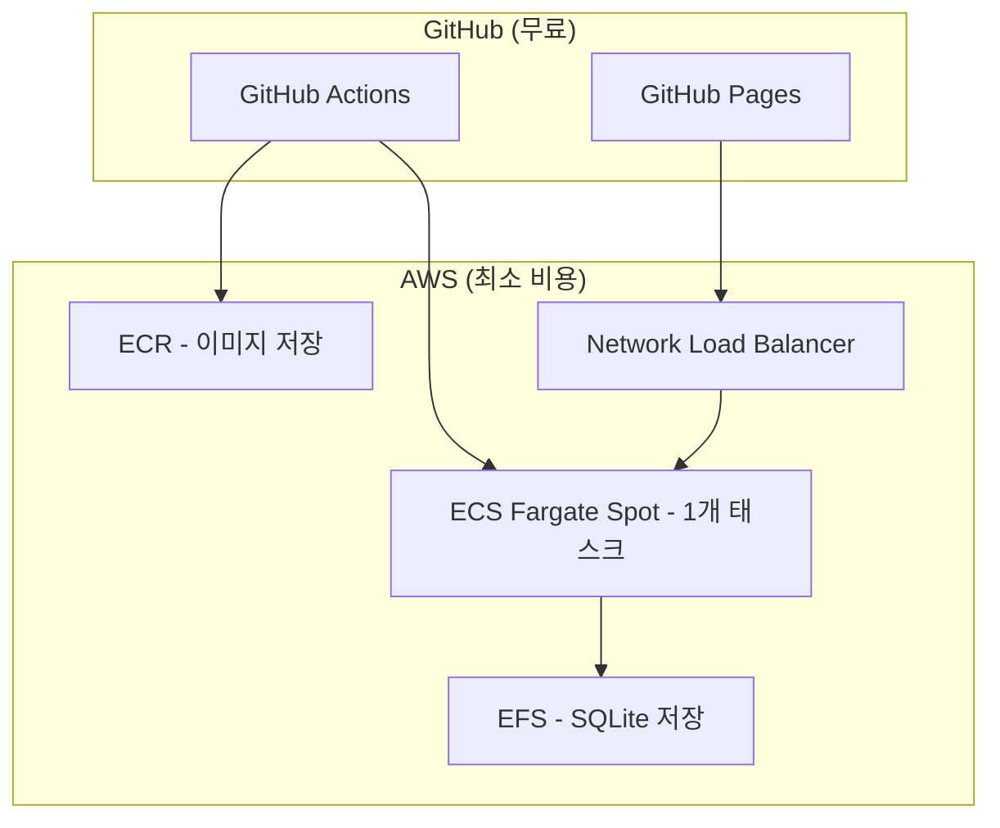

# PRD 리뷰: 학습용 프로젝트 최적화 제안

## 🎯 리뷰 목적
**학습용 프로젝트**의 관점에서 최대한 빠르고 적은 비용으로 개발/운영할 수 있도록 PRD 개선

## ⚠️ 주요 개선 필요 사항

### 1. 즉시 제거해야 할 복잡한 요소들

#### 🔴 제거 대상 (학습에 불필요한 복잡도)
```diff
- X-Ray 트레이싱 (모니터링 복잡도 증가)
- Container Insights (추가 비용 발생)
- SSL 인증서 및 HTTPS (개발 단계에서 불필요)
- E2E 테스트 자동화 (초기 구현 단계에서 과도)
- Playwright 테스트 (학습 단계에서 복잡)
- EventBridge, SQS, SNS (Phase 2에서도 과도)
- AWS WAF (보안은 나중에)
- CloudWatch 대시보드 (수동 확인으로 충분)
```

#### 🟡 단순화 대상
```diff
- ALB → Application Load Balancer 대신 Network Load Balancer 고려
- EFS 암호화 → 일단 비활성화 (성능 우선)
- 다중 AZ → 단일 AZ로 시작 (비용 절감)
- desiredCount: 2 → desiredCount: 1 (최소 비용)
```

### 2. 학습용 Phase 1 MVP 아키텍처 제안

#### 🚀 초간단 MVP 구성


### 3. 학습용 기술 스택 단순화

#### ✅ 유지할 것들 (핵심 학습 요소)
- **Fargate Spot 100%**: 비용 절감 + 실전 경험
- **EFS + SQLite**: 간단하면서도 영속성 보장
- **GitHub Pages**: 무료 호스팅
- **GitHub Actions**: CI/CD 학습

#### ❌ 제거할 것들 (학습 방해 요소)
- SSL/TLS 설정
- 모니터링 복잡도
- 보안 고급 설정
- 성능 최적화
- 자동화된 테스트

### 4. 비용 최적화 강화 제안

#### 💰 추가 비용 절감 방안
```yaml
# 최소 비용 설정
ECS_Task_CPU: 256 (최소)
ECS_Task_Memory: 512 (최소)
ECS_Desired_Count: 1 (최소)
EFS_Performance_Mode: generalPurpose (저비용)
ECR_Lifecycle: 5개 이미지만 유지
CloudWatch_Log_Retention: 1일 (최소)
```

#### 🎯 비용 모니터링 간소화
- AWS 예산 알람 1개만 설정 ($10 한도)
- 일일 비용 확인용 스크립트
- 복잡한 대시보드 대신 AWS CLI 명령어

### 5. 개발 속도 향상 제안

#### ⚡ 빠른 시작을 위한 변경
```diff
# 기존 (복잡)
- AWS CDK TypeScript 프로젝트 구성
- OIDC Provider 설정
- 복잡한 IAM 권한 관리
- 완전한 CI/CD 파이프라인

# 제안 (간단)
+ AWS CLI 스크립트로 시작
+ AdministratorAccess 권한 사용 (학습용)
+ 수동 배포로 시작 → 점진적 자동화
+ 최소한의 Docker 설정
```

#### 🔧 단계별 구현 전략
1. **1단계 (1일)**: 로컬 Docker + ECR 푸시
2. **2단계 (1일)**: ECS 수동 배포 + 동작 확인
3. **3단계 (1일)**: GitHub Actions 자동화
4. **4단계 (선택)**: 필요한 기능만 점진적 추가

### 6. 학습 가치 극대화 제안

#### 📚 핵심 학습 포인트 집중
```yaml
우선순위_1_필수:
  - Docker 컨테이너화
  - AWS ECS 기본 개념
  - Fargate Spot 비용 최적화
  - EFS 파일 시스템

우선순위_2_권장:
  - GitHub Actions CI/CD
  - AWS CLI 실전 활용
  - 기본 모니터링

우선순위_3_선택:
  - IaC (CDK)
  - 고급 보안
  - 성능 최적화
```

#### 🎓 학습 경험 개선
- **문제 해결 중심**: 막힐 때마다 단계적 해결
- **비용 의식**: 실시간 비용 확인 습관
- **실전 운영**: Spot 인터럽션 경험

### 7. PRD 구조 개선 제안

#### 📋 섹션 재구성
```diff
# 현재 구조 (복잡)
- 상세한 기술 스택
- 복잡한 아키텍처 다이어그램
- 고급 기능 설명

# 제안 구조 (간단)
+ Phase 1: MVP 최소 구현 (1-2일)
+ Phase 1.5: 기본 자동화 (1일)
+ Phase 2: 점진적 개선 (선택사항)
+ 비용 절감 중심 가이드
```

## 🎯 구체적 실행 제안

### Phase 1 MVP (2일 목표)
```bash
Day 1: 기본 배포
- Docker 이미지 생성
- ECR 업로드
- ECS 클러스터 생성 (CLI)
- 1개 태스크로 실행

Day 2: 프론트엔드 연동
- GitHub Pages 배포
- EFS 마운트
- 기본 동작 확인
```

### 예상 비용 (월간)
```yaml
Fargate_Spot_1_Task: ~$5
EFS_Storage_1GB: ~$0.30
ALB: ~$16 → NLB: ~$16
ECR_Storage: ~$1
CloudWatch_Logs: ~$1
---
총_예상_비용: ~$23/월 (기존 대비 70% 절감)
```

## 💡 최종 권장사항

1. **즉시 단순화**: 복잡한 기능 50% 제거
2. **비용 최우선**: 모든 결정을 비용 기준으로
3. **학습 중심**: 막히면 우회, 완벽함 추구 금지
4. **점진적 확장**: 동작 후 필요한 것만 추가

## 🚨 주의사항

- **과도한 최적화 금지**: 학습 목적에 맞는 수준 유지
- **비용 모니터링 필수**: 예산 초과 방지
- **문서화 최소화**: 코드 우선, 문서는 나중에